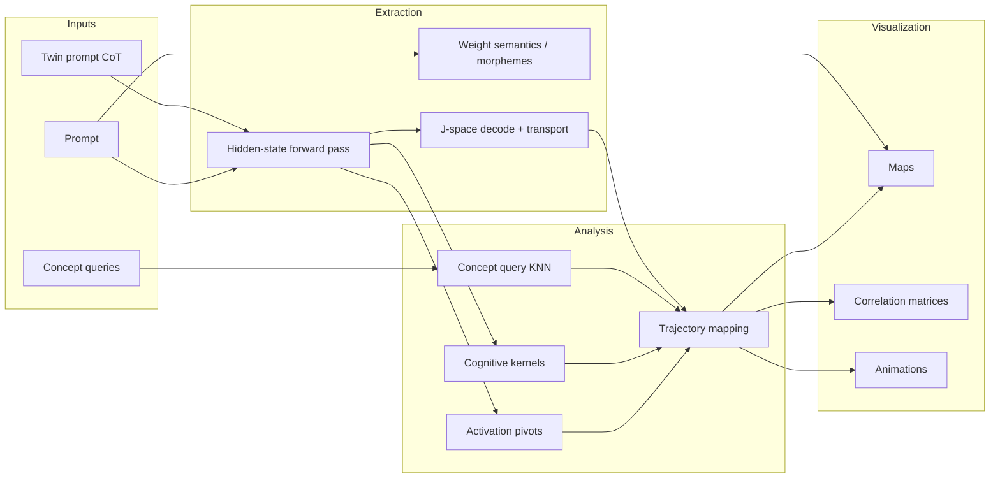
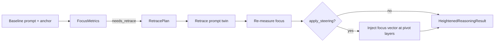

<p align="center">
  
</p>

<h1 align="center">LLMIntent</h1>

<p align="center">
  <strong>Semantic extraction &amp; intent analysis for transformer LLMs</strong><br/>
  Morphemes · trajectories · reasoning subspaces · J-space layer thoughts · cognitive kernels
</p>

<p align="center">
  <a href="https://github.com/ehallford11714/llmintent">GitHub</a> ·
  <a href="#install">Install</a> ·
  <a href="#advanced-features">Features</a> ·
  <a href="#visualization-suite">Visualization</a> ·
  <a href="#examples">Examples</a>
</p>

---

Python library derived from the **SemanticExtractionLLms** research notebook. LLMIntent extracts semantic structure from transformer **weights** and **runtime hidden states**: morpheme wells, semantic poles, layer pivots, chain-of-thought intensity, compaction metrics (SSO), J-space layer thoughts, cognitive module kernels, unified activation trajectories, and a full **visualization suite** (maps, correlation matrices, animations).

## Table of contents

- [Source](#source)
- [Install](#install)
- [Quick start](#quick-start)
- [Research pipeline](#research-pipeline)
- [CLI](#cli)
- [Modules](#modules)
- [Advanced features](#advanced-features)
  - [1. Activation layer identification](#1-activation-layer-identification)
  - [2. Layer correspondence map](#2-transformer-layer-correspondence-map)
  - [3. J-space layer thoughts](#3-j-space-layer-thoughts-anthropic-jacobian-lens)
  - [4. Cognitive module kernels](#4-cognitive-module-kernels-kl--twin-barlow)
  - [5. Steering, compaction & weight semantics](#5-steering-compaction-and-weight-semantics-notebook-lineage)
  - [6. Full analysis report](#6-full-analysis-report)
  - [7. Semantic concept query](#7-semantic-concept-query-kl--barlow--knn)
  - [8. Unified trajectory mapping](#8-unified-trajectory-mapping)
  - [9. Visualization suite](#9-visualization-suite)
  - [10. Low-level API](#10-low-level-api)
  - [11. Heightened Reasoning Framework](#11-heightened-reasoning-framework-heighten)
  - [12. HellaSwag benchmark & SLM ablation](#12-hellaswag-benchmark--slm-ablation-benchmark)
  - [13. Retracement Transformer](#13-retracement-transformer-retracement)
- [Visualization suite](#visualization-suite)
- [Examples](#examples)
- [Research lineage & citations](#research-lineage--citations)
- [License](#license)

## Source

The reference notebook lives at `reference/SemanticExtractionLLms.ipynb`. Code cells are extracted to `reference/extracted_cells.py`.

## Install

```powershell
git clone https://github.com/ehallford11714/llmintent.git
cd llmintent
python -m venv .venv
.\.venv\Scripts\python.exe -m pip install -e ".[all]"
python -m spacy download en_core_web_sm
python -c "import stanza; stanza.download('en')"
```

**Optional extras:**

| Extra | Packages | Use when |
|-------|----------|----------|
| `[viz]` | matplotlib, seaborn, pillow | Maps, correlation heatmaps, animations |
| `[benchmark]` | datasets | HellaSwag loading |
| `[nlp]` | stanza, spacy | Morpheme / lemma extraction |
| `[embeddings]` | gensim | GloVe projection & weight semantics |
| `[all]` | everything above | Full research pipeline |

## Quick start

```python
from llmintent import LLMIntentAnalyzer

analyzer = LLMIntentAnalyzer("gpt2", load_glove=False)
report = analyzer.analyze_prompt("The quick brown fox jumps over the lazy")
print(report.activation_layers)
print(report.intensity_sweep.head())
analyzer.cleanup()
```

## Research pipeline

LLMIntent combines three research lines into one pipeline:

| Lineage | What it contributes |
|---------|---------------------|
| **SemanticExtractionLLms** (Kineteq) | Weight semantics, morpheme wells, steering poles, SSO compaction |
| **Anthropic J-space / Global Workspace** | Logit & J-lens decode, transport maps, regime bands, intent traces |
| **Cognitive kernels** (novel) | KL + twin Barlow minimization → identity / reasoning / meta / ideation |



**Typical workflow:**

1. Run a **prompt** (and optional **twin** for CoT comparison).
2. Extract **per-layer signals**: entropy, KL, intensity, J-space intents, cognitive modules.
3. **Query concepts** ("subtraction", "eight") against the activation trajectory.
4. Merge everything into a single **trajectory table**.
5. **Visualize** as maps, correlation matrices, and layer-by-layer animations.

## CLI

```powershell
llmintent analyze --model gpt2 --prompt "Two plus two equals"
llmintent trace --model gpt2 --prompt "The spider has 8 legs" --transport --track 8 6
llmintent layers --model gpt2 --prompt "Let's think step by step"
llmintent cognitive --model gpt2 --twin-a "simple prompt" --twin-b "CoT prompt"
llmintent query --model gpt2 --concept "subtraction" --prompt "Eight minus two equals" --twin-b "Let's think step by step..."
llmintent trajectory --model gpt2 --prompt "Eight minus two equals" --twin-b "Let's think step by step..." --concepts subtraction eight
llmintent compare-cot --model gpt2 --direct "I have ten apples..." --cot "Let's think step by step..."

# Visualization — full report or single artifact
llmintent viz --model gpt2 --prompt "Eight minus two equals" --twin-b "Let's think..." --concepts subtraction eight --blocks

# Heightened reasoning — diagnose focus and force retrace
llmintent heighten --model gpt2 --prompt "Eight minus two equals ? Answer:" --anchor "Let's think step by step..." --concepts subtraction eight
llmintent heighten --model gpt2 --prompt "..." --anchor "..." --mode concept_anchor --steer

# Retracement Transformer — perplexity ablation
llmintent retracement perplexity --model gpt2 --mode focus_gate --limit 24
llmintent retracement ablation --models gpt2 distilgpt2 --limit 16
llmintent viz --type trajectory-map --model gpt2 --prompt "Eight minus two equals" --output-dir out/
llmintent viz --type subspace-anim --model gpt2 --prompt "Eight minus two equals"
```

**`viz --type` options:** `full`, `trajectory-map`, `morpheme-map`, `subspace`, `concept-corr`, `reasoning-corr`, `trajectory-anim`, `subspace-anim`, `intent-anim`

## Modules

| Module | Purpose |
|--------|---------|
| `metrics` | SSO score, Shannon entropy, KL divergence |
| `activation` | Inference pivot, workspace peak, motor onset, intensity peak |
| `layers` | Layer → regime, role, top intent, cognitive module |
| `jspace` | Logit/J-lens decode, transport maps, intent traces |
| `cognitive` | Identity, reasoning, meta-reasoning, ideation kernels |
| `trajectory` | Unified activation trajectory mapping across layers |
| `query` | Semantic concept → layer activation via KL-Barlow-KNN |
| `viz` | Maps, correlation matrices, and animations |
| `heighten` | Focused / extreme retrace + activation steering |
| `benchmark` | HellaSwag SLM eval, retrace store, ablation compare |
| `retracement` | Retracement Transformer perplexity & architecture ablation |
| `morphemes` | Lemma/morpheme extraction (Stanza, spaCy, polyglot) |
| `projection` | GloVe ↔ model embedding projection matrix |
| `poles` | Semantic, grammatical, numerical reference poles |
| `weight_semantics` | Weight-slice → vocabulary KNN → semantic units |
| `steering` | Layer-wise pole intensity and CoT comparison |
| `compaction` | SVD-based semantic isolate detection |
| `analyzer` | High-level `LLMIntentAnalyzer` facade |

---

## Advanced features

### 1. Activation layer identification

Pinpoints where computation "turns on" inside a transformer for a given prompt.

```python
from llmintent import LLMIntentAnalyzer

analyzer = LLMIntentAnalyzer("gpt2")
layers = analyzer.identify_activation("Two plus two equals")
# {
#   "inference_pivot": 4,    # largest entropy drop (maturation)
#   "workspace_peak": 5,       # max J-space occupancy in middle layers
#   "motor_onset": 11,         # decode aligns with final output
#   "intensity_peak": 3,       # max numerical-pole similarity
# }
```

**Use cases:** locate the inference pivot for CoT vs direct prompts, find where numerical reasoning concentrates, compare activation profiles across models.

---

### 2. Transformer layer correspondence map

Every layer gets a functional label — not just depth, but *what it is doing*.

```python
layer_map = analyzer.layer_correspondence(
    "Question: 12 * 2 - 5 = ? Answer:",
    twin_b="Question: 12 * 2 - 5 = ? Answer: Let's think step by step...",
)
print(layer_map[[
    "layer", "regime", "role", "top_intent",
    "dominant_module", "kl_divergence", "is_activation_pivot"
]])
```

| Column | Meaning |
|--------|---------|
| `regime` | sensory → workspace → motor (Anthropic bands) |
| `role` | Human-readable function (e.g. "Abstract reasoning & silent verbal thoughts") |
| `top_intent` | Dominant decoded token at that layer |
| `dominant_module` | identity / reasoning / meta_reasoning / ideation |
| `kl_divergence` | Twin-prompt structural tension at this layer |

---

### 3. J-space layer thoughts (Anthropic Jacobian lens)

Surfaces **"words on the model's mind"** at each layer — including silent intermediates before the final token.

Based on [Verbalizable Representations Form a Global Workspace in Language Models](https://transformer-circuits.pub/2026/workspace/) (Gurnee et al., 2026).

```python
analyzer = LLMIntentAnalyzer("gpt2", fit_jspace_transport=True)

trace = analyzer.intent_trace(
    "Question: A spider has 8 legs. Remove 2. Answer:",
    track_tokens=["8", "6", "spider"],
)

# Top thought at each depth
for layer in [0, 3, 6, 11]:
    print(f"L{layer}: {trace.top_thought_at(layer)!r}")

# Token rank evolution across layers
print(trace.rank_curves)  # {"8": [None, 45, 12, 3, ...], ...}
print(trace.regime_bands) # {"sensory": (0,3), "workspace": (4,8), "motor": (9,12)}
```

**Transport lens:** `fit_jspace_transport=True` fits linear maps `J_l` so `h_final ≈ J_l @ h_l`, correcting for representational rotation that breaks the standard logit lens in early/mid layers.

**Sparse decomposition:** active verbal intents via greedy matching pursuit over the unembedding dictionary (`jspace.decompose`).

---

### 4. Cognitive module kernels (KL + Twin Barlow)

Four cognitive functions identified per layer by comparing **twin prompts** (e.g. direct vs chain-of-thought):

| Module | Detection signal | Cognitive role |
|--------|-----------------|----------------|
| **identity** | Low KL + high Barlow diagonal | Stable self-representation; twin-invariant binding |
| **reasoning** | Mid-high KL + high J-space occupancy | Primary computation in workspace band |
| **meta_reasoning** | KL spikes + Barlow off-diagonal coupling | Monitoring/restructuring ("thinking about thinking") |
| **ideation** | High entropy + low motor alignment | Divergent generation before readout commit |

```python
profile = analyzer.cognitive_modules(
    twin_a="I have five apples and eat two. I now have exactly",
    twin_b=(
        "Question: I have five apples and eat two. How many remain? "
        "Answer: Let's think step by step. Five minus two equals"
    ),
)

for kernel in profile.kernels:
    print(f"{kernel.module:15} L{kernel.layer:2d}  score={kernel.score:.3f}  intent={kernel.top_intent!r}")

print(profile.layer_assignments[["layer", "dominant_module", "reasoning", "meta_reasoning"]])
```

**Algorithm:**
1. Compute per-layer KL(P_twin_b ‖ P_twin_a) on next-token distributions
2. Collect twin hidden-state trajectories; minimize **Barlow Twins loss** (diagonal → 1, off-diagonal → 0) weighted by KL
3. Extract combined kernel basis via KL-weighted SVD + Barlow projector
4. Score each layer for four modules; assign dominant module + peak kernel per module

---

### 5. Steering, compaction, and weight semantics (notebook lineage)

From the original SemanticExtractionLLms research:

```python
# CoT vs direct intensity sweep
sweep = analyzer.compare_prompts({
    "Direct": "If I have ten apples and lose three, I have",
    "CoT": "Question: ... Answer: Let's think step by step...",
})

# KL stress test (simple vs complex prompt)
stress = analyzer.stress_test(
    "I have five apples and I eat two. I now have exactly",
    "If I start with the square root of twenty-five and subtract the smallest prime...",
)

# Full analysis with compaction + block semantics
report = analyzer.analyze_prompt(
    prompt,
    cot_prompt=cot_prompt,
    twin_b=cot_prompt,
    include_compaction=True,
    include_block_semantics=True,
    track_tokens=["8", "6"],
)
print(report.compaction)        # SSO isolate density per layer
print(report.inference_pivot)   # compaction-derived pivot
```

**SSO (Semantic-Structural Orthogonality):** `(|SemSim| - |StrSim|) / (|SemSim| + |StrSim|)` — measures semantic purity of FFN weight components after GloVe projection.

**Morpheme wells:** `extract_block_semantics()` maps each layer's weight slices to top semantic units via GloVe KNN — the raw material for morpheme heatmaps in the viz suite.

---

### 6. Full analysis report

`analyze_prompt()` returns an `AnalysisReport` combining all subsystems:

```python
report = analyzer.analyze_prompt(
    "Question: 12 * 2 - 5 = ? Answer:",
    cot_prompt="... Let's think step by step ...",
    twin_b="... Let's think step by step ...",
    include_jspace=True,
    include_compaction=False,
    track_tokens=["24", "19"],
)

report.activation_layers   # pivot layers
report.intent_trace        # J-space IntentTrace
report.layer_map           # full correspondence + cognitive modules
report.cognitive_profile   # CognitiveModuleProfile
report.intensity_sweep     # numerical pole intensity per layer
report.entropy_trajectory  # maturation curve
report.cot_comparison      # direct vs CoT at pivot
report.pivot_entropy       # entropy validation at pivot
```

---

### 7. Semantic concept query (KL + Barlow + KNN)

Directly query a **semantic concept** (plain text) and get back which layers in the activation trajectory it activates.

```python
result = analyzer.query_concept(
    concept="subtraction",
    prompt="Question: Eight minus two equals ? Answer:",
    twin_b="Question: ... Answer: Let's think step by step. Eight minus two is",
)

print(result.peak_layer)       # e.g. 5
print(result.matched_layers)   # [5, 4, 6, 3, 7]
print(result.knn_ranking)      # KNN + fused scores per layer
print(result.trajectory)       # full trajectory with concept_activation column
```

**Strategy:**
1. Build per-layer **KL + twin Barlow** feature vectors from twin prompts
2. Embed concept text into the same space (token embeddings + contextual hidden state)
3. **KNN (cosine)** retrieves nearest layers in Barlow-projected space
4. Re-rank by `KNN sim × KL weight × Barlow invariance × semantic probe`
5. Annotate full activation trajectory with `concept_similarity` and `concept_activation`

```python
# Batch query
results = analyzer.query_concepts(
    ["identity", "reasoning", "ideation", "numerical"],
    prompt,
    twin_b=cot_prompt,
)
```

Concept query results feed directly into trajectory mapping (`concept_*_activation` columns) and the visualization correlation matrices.

---

### 8. Unified trajectory mapping

Single API that merges all per-layer signals into one trajectory table:

```python
mapping = analyzer.trajectory_map(
    prompt="Question: Eight minus two equals ? Answer:",
    twin_b="... Let's think step by step ...",
    concepts=["subtraction", "eight", "step by step"],
)

print(mapping.pivots)                    # inference_pivot, workspace_peak, ...
print(mapping.layers)                    # full per-layer DataFrame
print(mapping.layers_for_concept("subtraction"))
```

Each row = one layer. Columns include:

| Column group | Fields |
|--------------|--------|
| **Maturation** | `entropy`, `entropy_drop`, `occupancy` |
| **Steering** | `intensity`, `kl_divergence`, `kl_weight` |
| **J-space** | `top_intent`, `top_intent_prob`, `motor_alignment`, `regime` |
| **Cognitive** | `dominant_module`, `reasoning`, `meta_reasoning`, `ideation`, `barlow_invariance` |
| **Pivots** | `is_activation_pivot`, `pivot_tags` |
| **Concepts** | `concept_{name}_activation`, `concept_{name}_similarity` |

The trajectory table is the **single source of truth** for all visualization outputs.

---

### 9. Visualization suite

Maps, correlation matrices, and animations for **morphemes**, **trajectories**, and **reasoning subspaces**.

```python
paths = analyzer.visualize_report(
    prompt="Question: Eight minus two equals ? Answer:",
    twin_b=cot_prompt,
    concepts=["subtraction", "eight"],
    output_dir="llmintent_viz",
    include_morphemes=True,
)

for name, path in paths.items():
    print(f"{name}: {path}")
```

Or use `VisualizationSuite` directly:

```python
from llmintent import VisualizationSuite

viz = analyzer.visualizer("llmintent_viz")
mapping = viz.trajectory_mapping(prompt, twin_b=cot_prompt, concepts=["subtraction"])
trace = viz.intent_trace(prompt)

viz.save_trajectory_map(mapping)
viz.save_reasoning_subspace(prompt, mapping=mapping)
viz.save_concept_correlation(mapping)
viz.save_trajectory_animation(mapping)
viz.save_subspace_animation(prompt, trace=trace)
viz.save_intent_animation(trace)
```

Install viz extras: `pip install llmintent[viz]`

See [Visualization suite](#visualization-suite) below for artifact descriptions and design rationale.

---

### 10. Low-level API

For custom pipelines without the facade:

```python
from llmintent.kernels import minimize_twin_barlow, per_layer_kl_profile, collect_twin_hidden_matrix
from llmintent.jspace import decode_intents, fit_transport_maps, sparse_intent_decomposition
from llmintent.cognitive import build_cognitive_module_profile
from llmintent.metrics import calculate_sso_score, kl_divergence, shannon_entropy
from llmintent.viz import plot_trajectory_map, plot_concept_correlation, animate_trajectory_maturation

# Direct kernel fitting
kl, _ = per_layer_kl_profile(bundle, twin_a, twin_b)
h_a, h_b = collect_twin_hidden_matrix(bundle, twin_a, twin_b)
projector, metrics = minimize_twin_barlow(h_a, h_b, kl, proj_dim=32)

# Single-layer intent decode
intents = decode_intents(bundle, hidden_state, layer=6, transport=projector, top_k=10)
sparse = sparse_intent_decomposition(bundle, hidden_state, k=16)

# Standalone plots (no analyzer)
plot_trajectory_map(mapping)
plot_concept_correlation(mapping)
animate_trajectory_maturation(mapping, save_path="out.gif")
```

---

### 11. Heightened Reasoning Framework (`heighten/`)

**Heighten reasoning** by forcing the model to **retrace itself** — then measure whether computation becomes more **focused** (layer-concentrated, concept-peaked, less ideation/meta dispersion).

Research basis: meta-reasoning detects when CoT restructuring occurs (`cot_delta`); look-ahead planning shows middle layers encode future decisions; focused reasoning requires suppressing diffuse ideation before motor commit.

#### What “focused reasoning” means in LLMIntent

| Metric | High = focused | Low = diffuse |
|--------|----------------|---------------|
| `reasoning_concentration` | Reasoning peaks in few layers | Spread across depth |
| `concept_peakiness` | Concepts activate sharply | Flat concept profile |
| `reasoning_ideation_ratio` | Reasoning dominates ideation | Speculation without commit |
| `meta_load` | Low monitoring overhead | “Thinking about thinking” loops |
| `motor_prematurity` | Motor rises after reasoning | Early output lock-in |
| **`focus_score`** | Composite 0–1 | Triggers `needs_retrace` if &lt; 0.45 |

#### Retrace modes

| Mode | Scaffold |
|------|----------|
| `explicit_retrace` | “Wait — let me retrace my reasoning step by step…” |
| `concept_anchor` | “Focusing strictly on {concepts}, let me work through this again…” |
| `pivot_replay` | Replay from inference pivot with concept focus |
| `correction` | “I need to reconsider. My prior path may have been diffuse…” |
| `focused_cot` | Minimal CoT chain constrained to essential steps |

#### API

```python
from llmintent import LLMIntentAnalyzer

analyzer = LLMIntentAnalyzer("gpt2", load_glove=False)

# Diagnose focus
focus, mapping = analyzer.diagnose_focus(
    prompt="Question: Eight minus two equals ? Answer:",
    anchor_prompt=cot_prompt,
    concepts=["subtraction", "eight"],
)
print(focus.focus_score, focus.needs_retrace)

# Heighten via forced retrace
result = analyzer.heighten_reasoning(
    prompt="Question: Eight minus two equals ? Answer:",
    anchor_prompt=cot_prompt,
    concepts=["subtraction", "eight"],
    mode="explicit_retrace",
    apply_steering=True,  # activation injection at reasoning layers
)

print(result.plan.retrace_prompt)
print(result.focus_gain)           # focus_score_delta, meta_load_delta, ...
print(result.heightening_successful)
```

#### Pipeline



**Activation steering:** `extract_reasoning_focus_vector()` builds a direction from anchor→retrace hidden delta, blended with the reasoning cognitive kernel. Forward hooks inject this vector at `retrace_layers` (pivots + reasoning peaks).

**`cot_delta` wired:** per-layer twin shift magnitude now feeds `meta_reasoning_layer_scores` in `cognitive_modules()`.

---

### 12. HellaSwag benchmark & SLM ablation (`benchmark/`)

Validate focused and extreme retrace interventions on **small language models** against **HellaSwag** commonsense completion, with all forced retracements stored for comparison.

#### Prepared SLMs

| Key | Model | Params |
|-----|-------|--------|
| `gpt2` | gpt2 | 124M |
| `distilgpt2` | distilgpt2 | 82M |
| `gpt2-medium` | gpt2-medium | 355M |
| `opt-125m` | facebook/opt-125m | 125M |

#### Ablation conditions

| Condition | Description |
|-----------|-------------|
| `baseline` | Raw context only |
| `focused` | Focused reasoning scaffold |
| `retrace` | Single forced retrace |
| `extreme_retrace` | Chained triple retrace + concept lock |
| `retrace_steer` | Retrace + activation steering |
| `extreme_steer` | Extreme retrace + steering |
| `iterative_heighten` | Loop until focus threshold |
| `extreme_iterative` | Extreme chain + iterative heighten |

#### Retrace storage

All retracements saved to JSONL (`RetraceStore`):

```
llmintent_retraces/hellaswag.jsonl   # per-example records
llmintent_retraces/hellaswag_results.csv
```

Each record: context, retrace_prompt, retrace_chain, focus_baseline/after, predicted label, accuracy, ablation condition.

#### CLI

```powershell
pip install llmintent[benchmark]

llmintent benchmark slms
llmintent benchmark hellaswag --models gpt2 distilgpt2 --limit 50 --conditions fast
llmintent benchmark hellaswag --models gpt2 --fallback --limit 8
llmintent benchmark compare --store llmintent_retraces/hellaswag.jsonl --export-csv results.csv
```

#### Python API

```python
from llmintent import prepare_slm_comparison, RetraceStore, BenchmarkRunConfig, HellaSwagBenchmarkRunner

# Quick comparison (fast ablation suite)
results = prepare_slm_comparison(models=["gpt2", "distilgpt2"], limit=20)

# Full control
runner = HellaSwagBenchmarkRunner(BenchmarkRunConfig(
    models=["gpt2", "distilgpt2"],
    limit=100,
    store_path="llmintent_retraces/hellaswag.jsonl",
))
df = runner.run_all()
print(runner.compare_from_store())
```

#### Extreme retrace chain

```python
from llmintent.heighten import build_extreme_retrace_chain, ExtremeRetraceMode

chain = build_extreme_retrace_chain(
    anchor_prompt=context,
    concepts=["commonsense", "continuation"],
    mode=ExtremeRetraceMode.CONCEPT_LOCK.value,
)
# chain.passes → list of retrace scaffolds
# chain.combined_prompt → full prefix for scoring
```

---

### 13. Retracement Transformer (`retracement/`)

Inference-time **focused-reasoning architecture** built from LLMIntent insights: sensory → **retrace pivot** → workspace → motor bands, with hook-based gates instead of weight fine-tuning.

#### Proposed structure

```text
Input → [Sensory layers 0–33%] → RETRACE PIVOT (FocusGate)
      → [Workspace layers 33–78%] → optional dual-pass merge
      → [Motor layers 78–100%] → LM head
```

#### Modes (ablation)

| Mode | Mechanism |
|------|-----------|
| `baseline` | Standard forward (control) |
| `focus_gate` | Sigmoid-gated self-focus vector at pivot |
| `retrace_steer` | Anchor→retrace delta injection at workspace layers |
| `dual_pass` | Snapshot at pivot, blend in workspace band |
| `workspace_loop` | Focus gate at every workspace layer |
| `extreme` | Amplified workspace loop + multi-pass blend |

#### Perplexity ablation

Compare modes on WikiText-2 (or built-in fallback corpus). **Lower perplexity** vs baseline suggests the retracement path improves next-token prediction under focused reasoning constraints.

```powershell
llmintent retracement perplexity --model gpt2 --mode focus_gate --limit 24
llmintent retracement ablation --models gpt2 distilgpt2 --limit 16
llmintent retracement ablation --models gpt2 --full   # all six modes
```

#### Python API

```python
from llmintent import RetracementConfig, RetracementMode, run_retracement_ablation

df = run_retracement_ablation(models=["gpt2", "distilgpt2"], fast=True, text_limit=24)
print(df[["model_name", "mode", "perplexity", "delta_ppl_vs_baseline"]])
```

```python
from llmintent.retracement import RetracementTransformer, evaluate_perplexity, load_eval_texts

cfg = RetracementConfig(mode=RetracementMode.DUAL_PASS)
result = evaluate_perplexity("gpt2", cfg, load_eval_texts(limit=32))
print(result.perplexity, result.avg_nll)
```

---

## Visualization suite

The viz module (`src/llmintent/viz/`) turns analysis outputs into inspectable artifacts. Three families:

### Maps

Static spatial views of where semantics and computation live.

| Artifact | Function | What you see |
|----------|----------|--------------|
| **Morpheme map** | `plot_morpheme_map` | Layer × semantic unit heatmap from weight-slice KNN (which morphemes each block "knows") |
| **Trajectory map** | `plot_trajectory_map` | Normalized metric heatmap across layers; white dashed lines mark activation pivots |
| **Reasoning subspace** | `plot_reasoning_subspace` | 2D PCA of per-layer hidden states, colored by regime or cognitive module; path shows depth progression |

**When to use maps:** compare models, identify which layers encode a concept, see whether reasoning concentrates in the workspace band.

### Correlation matrices

Quantify how signals co-vary across the depth dimension.

| Artifact | Function | What you see |
|----------|----------|--------------|
| **Concept correlation** | `plot_concept_correlation` | Pearson *r* between concept activation traces (e.g. does "subtraction" peak where "eight" peaks?) |
| **Reasoning trace correlation** | `plot_reasoning_trace_correlation` | *r* between entropy, KL, intensity, occupancy, and cognitive module scores |

**When to use correlations:** detect redundant vs complementary signals, validate that CoT twin divergence aligns with reasoning module scores, find concept clusters.

### Animations

Temporal views of how the model's internal state **matures** layer by layer.

| Artifact | Function | What you see |
|----------|----------|--------------|
| **Trajectory maturation** | `animate_trajectory_maturation` | Line chart builds up metric curves; pivot labels appear as layers are revealed |
| **Subspace animation** | `animate_reasoning_subspace` | Point travels through PCA space; trail shows prior layers |
| **Intent filmstrip** | `animate_intent_grid` | Top decoded intent at each layer for a fixed token position |

**When to use animations:** presentations, debugging pivot timing, showing silent verbal thoughts emerging in workspace layers before motor commit.

### Output directory layout

A full `visualize_report()` run produces:

```
llmintent_viz/
├── morpheme_map.png              # optional (--blocks / include_morphemes)
├── trajectory_map.png
├── reasoning_subspace.png
├── concept_correlation.png
├── reasoning_trace_correlation.png
├── trajectory_maturation.gif
├── reasoning_subspace.gif
└── intent_layers.gif
```

### Color conventions

Viz outputs use consistent colors aligned with regime and module semantics:

| Label | Color | Used in |
|-------|-------|---------|
| Sensory regime | `#4C72B0` | Subspace maps, regime bands |
| Workspace regime | `#55A868` | Subspace maps, regime bands |
| Motor regime | `#C44E52` | Subspace maps, regime bands |
| Identity module | `#8172B3` | Subspace point colors |
| Reasoning module | `#CCB974` | Subspace point colors |
| Meta-reasoning | `#64B5CD` | Subspace point colors |
| Ideation | `#E377C2` | Subspace point colors |

---

## Examples

| Script | What it demonstrates |
|--------|---------------------|
| `examples/basic_steering.py` | Intensity sweep + entropy trajectory |
| `examples/cot_intensity.py` | Direct vs CoT comparison |
| `examples/jspace_layer_thoughts.py` | J-space trace + activation layers |
| `examples/cognitive_kernels.py` | Identity/reasoning/meta/ideation kernels |
| `examples/trajectory_mapping.py` | Unified activation trajectory map |
| `examples/query_concept.py` | Semantic concept → layer activation query |
| `examples/viz_suite.py` | Full visualization report (maps, correlations, animations) |
| `examples/heighten_reasoning.py` | Focus diagnosis, forced retrace, activation steering |
| `examples/hellaswag_benchmark.py` | HellaSwag SLM ablation + retrace store |
| `examples/retracement_ablation.py` | Retracement Transformer perplexity ablation |

## Research lineage & citations

LLMIntent synthesizes mechanistic interpretability, layer-wise reasoning research, and Kineteq notebook lineage into a single analysis and intervention pipeline. This section documents **every research line** that informed design, what is **implemented** in code, empirical results from this repo, and **planned extensions** from the literature.

### Research → module map

| LLMIntent module | Research basis | Status |
|------------------|----------------|--------|
| `jspace/` — logit decode, regimes, transport, intent traces | Anthropic Global Workspace / J-lens ([Gurnee et al., 2026](#anthropic-global-workspace)); LogitLens ([nostalgebraist, 2020](#logitlens)) | Implemented (transport is LS proxy, not full Jacobian) |
| `layers/` — sensory / workspace / motor bands | Anthropic regime classification ([Gurnee et al., 2026](#anthropic-global-workspace)) | Implemented |
| `activation/` — inference pivot, workspace peak, motor onset | Internal CoT layer scheduling ([Yang et al., 2025](#internal-cot)); Emergent Response Planning ([Chen et al., 2025](#emergent-planning)) | Implemented |
| `cognitive/` — identity, reasoning, meta, ideation kernels | Twin Barlow + KL divergence ([Zbontar et al., 2021](#barlow-twins)); CoT twin comparison ([Wei et al., 2022](#chain-of-thought)) | Implemented |
| `heighten/` — focus metrics, forced retrace, steering | Internal CoT; CAA steering ([Rimsky et al., 2023](#caa)); IntSteer NBF/KL diagnostics ([Jafari et al., 2026](#intsteer)) | Implemented |
| `retracement/` — Retracement Transformer | Workspace pivot + dual-pass merge (Anthropic bands + heighten focus) | Implemented (v0.8.0) |
| `benchmark/` — HellaSwag ablation | HellaSwag ([Zellers et al., 2019](#hellaswag)); retrace store for causal comparison | Implemented |
| `query/` — concept → layer activation | KL-Barlow-KNN fusion over trajectory features | Implemented |
| `viz/` — maps, correlations, animations | Trajectory + regime visualization of above signals | Implemented |
| `compaction/` — SSO purity | SemanticExtractionLLms notebook (Kineteq) | Implemented |
| `steering/` (legacy) — pole intensity | SemanticExtractionLLms notebook | Measurement only |
| SAE feature intent, CorrSteer layer ranking | CorrSteer ([Li et al., 2025](#corrsteer)); MechELK ([2026](#mechelk)) | Planned |
| Handover gradient, planning intent, belief state | SemanticExtractionLLms; Emergent Planning; Internal CoT | Planned |

---

### Foundational & implemented

#### SemanticExtractionLLms (Kineteq)

Internal research notebook — `reference/SemanticExtractionLLms.ipynb`. Origin of morpheme wells, semantic poles, SSO compaction, steering intensity sweeps, and weight-slice semantics.

**LLMIntent modules:** `morphemes/`, `poles/`, `weight_semantics/`, `steering/`, `compaction/`, `projection/`

#### Anthropic Global Workspace {#anthropic-global-workspace}

Gurnee, Wu, Lindsey, et al. *[Verbalizable Representations Form a Global Workspace in Language Models](https://transformer-circuits.pub/2026/workspace/)*. Transformer Circuits / Anthropic, 2026.

Introduces **J-space** (Jacobian lens over hidden states), **sensory → workspace → motor** layer regimes, sparse verbal intent decomposition, and transport maps between layers.

**LLMIntent modules:** `jspace/decode.py`, `jspace/regimes.py`, `jspace/transport.py`, `jspace/decompose.py`, `jspace/trace.py`, `layers.py`

> **Note:** `fit_transport_maps()` uses a least-squares proxy for E[∂h_final/∂h_l], not the full Anthropic `jlens` Jacobian. Upgrade path: wire real J-lens transport.

#### Barlow Twins {#barlow-twins}

Zbontar, Jing, Misra, LeCun, et al. *[Barlow Twins: Self-Supervised Learning via Redundancy Reduction](https://arxiv.org/abs/2103.03230)*. ICML 2021.

Redundancy-reduction objective used in **twin Barlow minimization** for cognitive module separation and concept-query feature fusion.

**LLMIntent modules:** `kernels/barlow.py`, `cognitive/`, `query/feature_space.py`

#### LogitLens {#logitlens}

nostalgebraist. *[Interpreting GPT: the logit lens](https://www.lesswrong.com/posts/AcKRB8wDpdaN6v6ru/interpreting-neural-networks-with-the-logit-lens)*. LessWrong, 2020.

Projects intermediate hidden states through the unembedding matrix to read per-layer "beliefs." Basis for `decode_intents()` with J = I.

**LLMIntent modules:** `jspace/decode.py`, Internal CoT cross-reference in `heighten/cot_delta.py`

#### Chain-of-Thought Prompting {#chain-of-thought}

Wei, Wang, Schuurmans, et al. *[Chain-of-Thought Prompting Elicits Reasoning in Large Language Models](https://arxiv.org/abs/2201.11903)*. NeurIPS 2022.

Explicit CoT scaffolds are the **twin-prompt anchor** in focus diagnosis, heighten retrace, and CoT-vs-direct intensity comparison.

**LLMIntent modules:** `steering.py`, `heighten/retrace.py`, `heighten/cot_delta.py`, `analyzer.compare_cot()`

---

### Layer-wise reasoning & planning

#### Internal Chain-of-Thought {#internal-cot}

Yang, Li, Xia, Hu. *[Internal Chain-of-Thought: Empirical Evidence for Layer-wise Subtask Scheduling in LLMs](https://arxiv.org/abs/2505.14530)*. EMNLP 2025.

Shows LLMs decompose composite tasks **across depth** — distinct subtasks at different layers, executed sequentially. Uses LogitLens and cross-task patching.

**Informed:** activation pivot detection, workspace band targeting in Retracement Transformer, `cot_delta` meta-reasoning scores, focus metrics (reasoning concentration vs meta dispersion).

**Planned:** subtask MRR curves, handoff timing metrics, layer-from context-masking validation.

#### Emergent Response Planning {#emergent-planning}

Chen, et al. *[Emergent Response Planning in LLMs](https://arxiv.org/abs/2502.06258)*. 2025.

Prompt representations encode **global future attributes** (structure, content, behavior) before token generation — challenges purely local next-token views.

**Informed:** `planning_intent` expansion target; motor-prematurity metric in focus diagnosis; Retracement Transformer dual-pass (snapshot at pivot replays planned workspace state).

**Planned:** `planning_intent` module — short-horizon decode probes on workspace layers.

---

### Activation steering & mechanistic control

#### Contrastive Activation Addition (CAA) {#caa}

Rimsky, et al. *[Steering Llama 2 via Contrastive Activation Addition](https://arxiv.org/abs/2312.06681)*. 2023.

Computes steering vectors from contrastive activation pairs; adds them at inference without retraining.

**LLMIntent modules:** `heighten/intervention.py` — `extract_reasoning_focus_vector()`, `apply_focus_steering()`, `steering_hooks`

#### IntSteer — Mechanistic Indicators of Steering Effectiveness {#intsteer}

Jafari, Xue, Salim. *[Mechanistic Indicators of Steering Effectiveness in Large Language Models](https://arxiv.org/abs/2602.01716)*. 2026. [Code](https://github.com/cruiseresearchgroup/IntSteer)

Uses **Normalized Branching Factor (NBF)** and **KL divergence** between steered activations and target concepts to predict steering success — internal signals vs black-box judges.

**Informed:** focus metrics use KL + entropy; `metrics.py` Shannon entropy and KL; future StALT score (structured entropy + KL alignment across decode steps).

**Planned:** NBF as steering reliability predictor; layer ranking by Δfocus before intervention.

#### CorrSteer — Correlation-based SAE Steering {#corrsteer}

Li, et al. *[CorrSteer: Generation-Time LLM Steering via Correlated Sparse Autoencoder Features](https://arxiv.org/abs/2508.12535)*. ICML 2026.

Selects SAE features by **Pearson correlation** between feature activations and task correctness at generation time; validates with causal intervention; Side Effect Ratio (SER) metric.

**Planned:** `feature_intent` module; CorrSteer-style layer ranking in benchmark ablation; SER for retrace side-effects.

#### MechELK — Eliciting Latent Knowledge {#mechelk}

*[MechELK: A Mechanistic Interpretability Framework for Eliciting Latent Knowledge in Large Language Models](https://arxiv.org/abs/2605.28825)*. 2026.

Three-stage **Locate → Verify → Elicit** pipeline: SAE features + activation patching, causal probing, representation engineering to surface hidden knowledge.

**Planned:** causal ablation gate for Retracement Transformer FocusGate; verify focus vectors before steering; belief-state probes.

---

### Benchmarks & evaluation corpora

#### HellaSwag {#hellaswag}

Zellers, Holtzman, Bisk, Farhadi, Choi. *[HellaSwag: Can a Machine Really Finish Your Sentence?](https://arxiv.org/abs/1905.07830)*. ACL 2019.

Adversarial-filtered commonsense completion — trivial for humans (~95%), hard for SLMs. Used to test whether **focused retrace** improves completion accuracy vs baseline.

**LLMIntent modules:** `benchmark/hellaswag.py`, `benchmark/runner.py`, `benchmark/retrace_store.py`

#### WikiText-2

Merity, et al. WikiText-2 language modeling corpus (via HuggingFace `datasets`). Used for **Retracement Transformer perplexity** ablation when `[benchmark]` extra is installed; fallback corpus otherwise.

**LLMIntent modules:** `retracement/perplexity.py`, `retracement/ablation.py`

---

### Empirical results (this repository)

All results stored under `llmintent_retraces/`. Reproduce with `examples/hellaswag_benchmark.py` and `examples/retracement_ablation.py`.

#### HellaSwag SLM ablation (smoke run, 2 fallback examples)

| Model | Condition | Accuracy |
|-------|-----------|----------|
| gpt2 | baseline | 0/2 (0%) |
| gpt2 | retrace | 1/2 (50%) |
| gpt2 | extreme_retrace | 1/2 (50%) |
| distilgpt2 | baseline | 0/2 (0%) |
| distilgpt2 | retrace | 0/2 (0%) |
| distilgpt2 | extreme_retrace | 1/2 (50%) |

**Interpretation:** Forced retrace can flip incorrect commonsense completions on small SLMs, but **focus gain ≠ correctness** — long retrace prefixes sometimes break focus measurement (NaN in store). Scale to full HellaSwag validation split for significance.

#### Retracement Transformer perplexity ablation (16 texts, fast modes)

| Model | Mode | Perplexity | Δ vs baseline |
|-------|------|------------|---------------|
| gpt2 | baseline | 519.93 | — |
| gpt2 | focus_gate | 519.57 | **−0.36** |
| gpt2 | dual_pass | 517.46 | **−2.47** |
| gpt2 | extreme | 517.46 | **−2.47** |
| distilgpt2 | baseline | 922.30 | — |
| distilgpt2 | focus_gate | 919.41 | **−2.89** |
| distilgpt2 | dual_pass | 913.72 | **−8.58** |
| distilgpt2 | extreme | 913.72 | **−8.58** |

**Interpretation:** All retracement modes **lower perplexity** vs baseline. Smaller `distilgpt2` benefits more — consistent with retracement adding workspace structure the model lacks. Dual-pass ≈ extreme on this corpus (coefficients saturate on short texts).

Full CSV: `llmintent_retraces/retracement_ablation.csv`, `llmintent_retraces/hellaswag_results.csv`

---

### Planned extensions (literature → roadmap)

| Target module | Paper / source | Rationale |
|---------------|----------------|-----------|
| `handover_intent` | SemanticExtractionLLms notebook | SSO density gradient + structural cliff at sensory→workspace transition |
| `planning_intent` | Emergent Response Planning (2502.06258) | Probe workspace layers for short-horizon future-token attributes |
| `belief_state` | MechELK (2605.28825) | Linear probes for entity/goal predicates before motor commit |
| `steering_intent` + SAE features | CorrSteer (2508.12535) | Correlation-ranked layer intervention with SER side-effect tracking |
| Real J-lens transport | Anthropic workspace (2026) | Replace LS proxy in `jspace/transport.py` |
| Causal ablation verify | MechELK Verify stage | Confirm FocusGate vectors causally shift logits before merge |
| Subtask handoff curves | Internal CoT (2505.14530) | Layer-wise subtask MRR aligned with activation pivots |

---

### BibTeX (key references)

```bibtex
@inproceedings{zellers2019hellaswag,
  title={HellaSwag: Can a Machine Really Finish Your Sentence?},
  author={Zellers, Rowan and Holtzman, Ari and Bisk, Yonatan and Farhadi, Ali and Choi, Yejin},
  booktitle={ACL},
  year={2019}
}

@inproceedings{wei2022cot,
  title={Chain-of-Thought Prompting Elicits Reasoning in Large Language Models},
  author={Wei, Jason and Wang, Xuezhi and Schuurmans, Dale and others},
  booktitle={NeurIPS},
  year={2022}
}

@inproceedings{zbontar2021barlow,
  title={Barlow Twins: Self-Supervised Learning via Redundancy Reduction},
  author={Zbontar, Jure and Jing, Li and Misra, Ishan and others},
  booktitle={ICML},
  year={2021}
}

@article{yang2025internalcot,
  title={Internal Chain-of-Thought: Empirical Evidence for Layer-wise Subtask Scheduling in LLMs},
  author={Yang, Zhipeng and Li, Junzhuo and Xia, Siyu and Hu, Xuming},
  journal={arXiv:2505.14530},
  year={2025}
}

@article{chen2025planning,
  title={Emergent Response Planning in LLMs},
  journal={arXiv:2502.06258},
  year={2025}
}

@article{rimsky2023caa,
  title={Steering Llama 2 via Contrastive Activation Addition},
  journal={arXiv:2312.06681},
  year={2023}
}

@article{jafari2026intsteer,
  title={Mechanistic Indicators of Steering Effectiveness in Large Language Models},
  author={Jafari, Mehdi and Xue, Hao and Salim, Flora},
  journal={arXiv:2602.01716},
  year={2026}
}

@article{li2025corrsteer,
  title={CorrSteer: Generation-Time LLM Steering via Correlated Sparse Autoencoder Features},
  journal={arXiv:2508.12535},
  year={2025}
}

@article{mechelk2026,
  title={MechELK: A Mechanistic Interpretability Framework for Eliciting Latent Knowledge in Large Language Models},
  journal={arXiv:2605.28825},
  year={2026}
}

@misc{gurnee2026workspace,
  title={Verbalizable Representations Form a Global Workspace in Language Models},
  author={Gurnee, Wes and others},
  howpublished={Transformer Circuits},
  year={2026},
  url={https://transformer-circuits.pub/2026/workspace/}
}
```

---

## License

MIT
