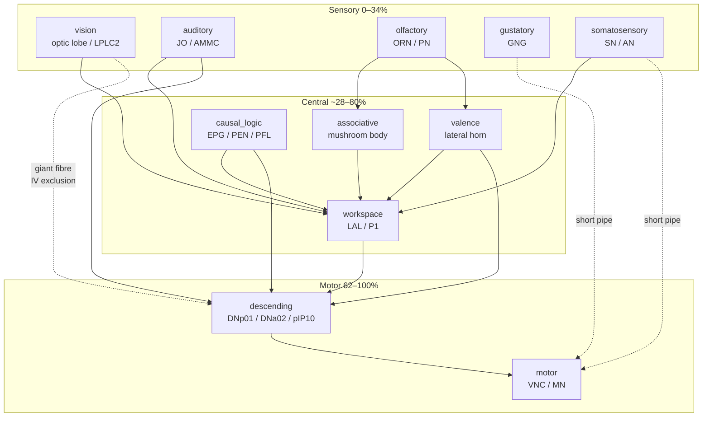
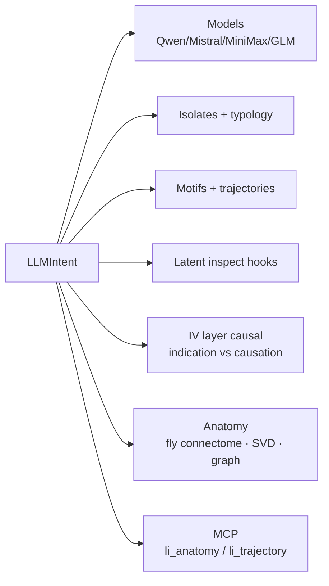
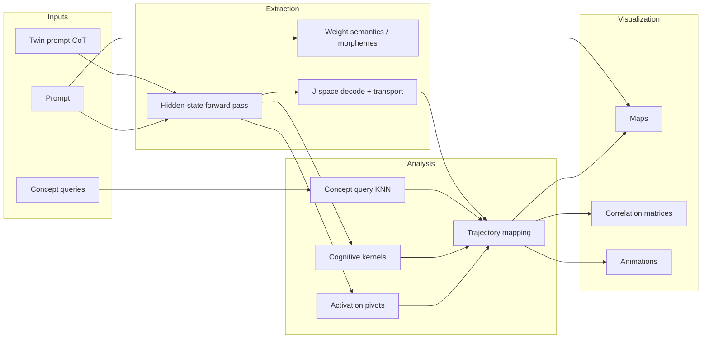
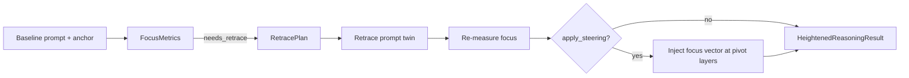

<p align="center">
  
</p>

<h1 align="center">LLMIntent</h1>

<p align="center">
  <strong>Semantic extraction &amp; intent analysis for transformer LLMs</strong><br/>
  Morphemes · trajectories · reasoning subspaces · J-space layer thoughts · cognitive kernels
</p>

<p align="center">
  <a href="https://github.com/ehallford11714/llmintent">GitHub</a> ·
  <a href="https://pypi.org/project/llmintent/">PyPI</a> ·
  <a href="#install">Install</a> ·
  <a href="#advanced-features">Features</a> ·
  <a href="#visualization-suite">Visualization</a> ·
  <a href="#examples">Examples</a>
</p>

---

Python library derived from the **SemanticExtractionLLms** research notebook. LLMIntent extracts semantic structure from transformer **weights** and **runtime hidden states**: morpheme wells, semantic poles, layer pivots, chain-of-thought intensity, compaction metrics (SSO), J-space layer thoughts, cognitive module kernels, unified activation trajectories, and a full **visualization suite** (maps, correlation matrices, animations).

## Table of contents

- [Source](#source)
- [Install](#install)
- [Quick start](#quick-start)
- [Model suite](#model-suite-qwen--mistral--minimax--glm)
- [Full product suite](#full-product-suite)
- [Research pipeline](#research-pipeline)
- [CLI](#cli)
- [Modules](#modules)
- [Advanced features](#advanced-features)
  - [1. Activation layer identification](#1-activation-layer-identification)
  - [2. Layer correspondence map](#2-transformer-layer-correspondence-map)
  - [3. J-space layer thoughts](#3-j-space-layer-thoughts-anthropic-jacobian-lens)
  - [4. Cognitive module kernels](#4-cognitive-module-kernels-kl--twin-barlow)
  - [5. Steering, compaction & weight semantics](#5-steering-compaction-and-weight-semantics-notebook-lineage)
  - [6. Full analysis report](#6-full-analysis-report)
  - [7. Semantic concept query](#7-semantic-concept-query-kl--barlow--knn)
  - [8. Unified trajectory mapping](#8-unified-trajectory-mapping)
  - [9. Visualization suite](#9-visualization-suite)
  - [10. Low-level API](#10-low-level-api)
  - [11. Heightened Reasoning Framework](#11-heightened-reasoning-framework-heighten)
  - [12. HellaSwag benchmark & SLM ablation](#12-hellaswag-benchmark--slm-ablation-benchmark)
  - [13. Retracement Transformer](#13-retracement-transformer-retracement)
  - [14. Live suite — real-time app](#14-live-suite--real-time-app-live)
- [Fly-connectome anatomy](#fly-connectome-anatomy-150)
  - [What was taken from the fly](#what-was-taken-from-the-fly)
  - [The eleven regions](#the-eleven-regions)
  - [Connectome wiring (IV prior)](#connectome-wiring-iv-prior)
  - [Compile, occupancy, ablation](#compile-occupancy-ablation)
  - [Qwen 27B residual test](#qwen-27b-residual-test)
  - [Anatomy of any weighted model](#anatomy-of-any-weighted-model)
  - [Trajectory and MisAlign Flag](#trajectory-and-misalign-flag)
- [Visualization suite](#visualization-suite)
- [Examples](#examples)
- [Research lineage & citations](#research-lineage--citations)
- [License](#license)

## Source

The reference notebook lives at `reference/SemanticExtractionLLms.ipynb`. Code cells are extracted to `reference/extracted_cells.py`.

## Install

### From PyPI

```powershell
pip install llmintent
pip install "llmintent[viz]"      # maps & animations
pip install "llmintent[live]"       # Streamlit UI + FastAPI
pip install "llmintent[models]"     # accelerate stack for Qwen/Mistral/MiniMax/GLM suite
pip install "llmintent[suite]"      # prefer external intentisolates (vendored isolates always included)
pip install "llmintent[all]"        # full research stack
```

### From source (development)

```powershell
git clone https://github.com/ehallford11714/llmintent.git
cd llmintent
python -m venv .venv
.\.venv\Scripts\python.exe -m pip install -e ".[all]"
python -m spacy download en_core_web_sm
python -c "import stanza; stanza.download('en')"
```

Publishing to PyPI: see [`docs/PUBLISHING.md`](docs/PUBLISHING.md).

**Optional extras:**

| Extra | Packages | Use when |
|-------|----------|----------|
| `[viz]` | matplotlib, seaborn, pillow | Maps, correlation heatmaps, animations |
| `[benchmark]` | datasets | HellaSwag loading |
| `[live]` | fastapi, uvicorn, streamlit | Real-time Live app + API |
| `[models]` / `[hf]` / `[slm]` | transformers, torch, accelerate | Curated Qwen/Mistral/MiniMax/GLM suite |
| `[suite]` / `[isolates]` | intentisolates (optional) | Prefer extractable isolates; core already vendors offline path |
| `[nlp]` | stanza, spacy | Morpheme / lemma extraction |
| `[embeddings]` | gensim | GloVe projection & weight semantics |
| `[all]` | everything above | Full research pipeline |

## Quick start

```python
from llmintent import LLMIntentAnalyzer

analyzer = LLMIntentAnalyzer("gpt2", load_glove=False)
report = analyzer.analyze_prompt("The quick brown fox jumps over the lazy")
print(report.activation_layers)
print(report.intensity_sweep.head())
analyzer.cleanup()
```

## Latent thought inspection (1.2.0+)

`llmintent.latent` ships **offline ThoughtReports** (rule tags, synthetic probes, SAE-lite, logit-lens stub) with mandatory epistemic caveats. Prefer extractable [`latentintent`](https://github.com/ehallford11714/latent-intent-inspect) when installed for HF residual capture; otherwise the vendored path always works.

```powershell
python -m llmintent latent --text "I want X but cannot Y. What should I do?"
python -m llmintent latent --status
python -c "from llmintent import latent; print(latent.inspect_text('Thanks!').summary_lines())"
# Residual capture on Qwen 27B (NF4, ~24 GB GPU):
# python -m llmintent latent --backend hf --model qwen:27b --4bit --format markdown --text "I hear a song because a dark shape is looming. What should I do?"
# Optional extractable + HF:
# pip install "llmintent[latent]"   # or: pip install -e ..\LatentIntentInspect
```

Docs: [`docs/SUITE.md`](docs/SUITE.md). SOTA map: [`../docs/SOTA_LATENT_THOUGHT_INSPECTION.md`](../docs/SOTA_LATENT_THOUGHT_INSPECTION.md). Reports are **correlates/probes**, not mind-reading.

## Fly-connectome anatomy (1.5.0)

The fly brain is the **guiding engine**, not a language model we pretend the transformer is. MaleCNS / literature-core wiring gives LLMIntent a closed region catalogue, an identification prior for instrumental variables, and a test that activating region A vs B must change the output.

This is an anatomical *prior*. It is **not** a claim that Qwen (or any transformer) grew an optic lobe.

Full write-up: [`docs/ANATOMY.md`](docs/ANATOMY.md). MCP: [`docs/MCP.md`](docs/MCP.md). Suite: [`docs/SUITE.md`](docs/SUITE.md).

```text
English
  → compile (aliases + intent docs; drop unmatched)
  → region occupancy through each prompt span
  → connectome paths as IV instruments (sensory Z ⊥ motor Y | path)
  → SVD map of residuals / FFN onto the same documents
  → Anatomy graph (connectome ∪ residual stream ∪ layer→intent)
  → trajectory: all layers × all intents
  → ablate A vs B (output must change)
  → MisAlign Flag if negative intent emerges off the user goal
```

### What was taken from the fly

Three things only. Nothing else is copied from the fly into the transformer.

| Taken from the fly | How it is used on the LLM | What it is *not* |
|--------------------|---------------------------|------------------|
| Literature-core **cell types** collapsed into 11 territories | Closed region catalogue (`vision` … `motor`) | A claim that Qwen has photoreceptors |
| **Neuropil jobs** (optic lobe sees looming; AMMC hears song; CX heads; DNp01 commits escape) | `what_region_does` — the job sentence on each region card | A neuropil count inside residual space |
| **Type→type edges** (ORN→PN→KC/LH; LPLC2→DNp01 giant fibre; EPG/PEN ring; PFL→DNa02) | Connectome graph as IV prior: sensory Z may instrument central X only if a path exists. Giant-fibre **vision→descending** is an exclusion violation | Proof of synaptic weights in the LM |

Depth bands follow the same cascade: sensory early (0–0.34 of residual blocks), central mid (≈0.28–0.80), motor late (0.62–1.0). That is a *depth prior*, not a layer-name from the fly.

### The eleven regions

Prompt used below: *I hear a song because a dark shape is looming. What should I do?*

`trace_prompt` splits on sentence punctuation and keeps `because` / `so` / `then` on the **following** span, so occupancy **varies**: auditory is on for *I hear a song* and off for the looming clause; vision and causal_logic do the reverse.

| Region | Band (depth) | Fly analogue | Fly types | What it **does** on an LLM prompt | Aliases | Example on that prompt |
|--------|--------------|--------------|-----------|-----------------------------------|---------|-------------------------|
| `vision` | sensory (0.00–0.34) | Optic lobe (retina / lamina / medulla / lobula / lobula plate) | R1–R6, L1/L2, T4/T5, LPLC2, LC4, LC10, HS | Reads luminance, motion, looming, spatial layout so later bands can treat collision versus scenery | see, look, light, dark, image, looming, colour | Span *because a dark shape is looming* |
| `auditory` | sensory (0.00–0.34) | JO-A/B → AMMC / WED | JO-A, JO-B, AMMC, WED | Reads pulse, song, sequential tone so rhythm can bind with other senses | hear, sound, audio, song, buzz, tone, rhythm | Span *I hear a song* |
| `olfactory` | sensory (0.00–0.34) | Antennal lobe | ORN_DA1, ORN, DA1_lPN/vPN, ALPN, ALLN | Reads chemical identity / naming cues for associative pairing | smell, odour, scent, pheromone | Silent here |
| `gustatory` | sensory (0.00–0.40) | GNG / SEZ, GRNs | GRN_labellar, GNG, MN9 | Reads appetitive drive — hunger, taste, ingest — as an approach/avoid bias | taste, hungry, food, sweet, bitter, drink | Silent here |
| `somatosensory` | sensory (0.00–0.34) | Peripheral / ascending | SN, AN | Reads touch, contact, and body state as an ascending channel | touch, brushes, contact, felt, body | Silent here |
| `associative` | central (0.28–0.72) | Mushroom body KC / DAN / MBON | KC, APL, DPM, PAM, PPL1, MBON | Binds earlier sensory tags into sparse memory: this cue with that outcome | remember, associate, bind, memory, learned | Silent unless the prompt asks to remember/bind |
| `valence` | central (0.28–0.66) | Lateral horn | LHAV4a4, LHAD1c2, LHAV4c1 | Assigns innate affect — approach or avoid — before a motor program is chosen | afraid, feel, hate, love, avoid, approach | Silent unless afraid/hate/avoid is said |
| `causal_logic` | central (0.30–0.78) | Central complex EPG / PEN / PFN / PFL | EPG, PEN, PFN, PFL | Runs if-then / because / heading: plans a path from causes to a next act | because, therefore, if, then, so that, plan | `because` kept on the looming span |
| `workspace` | central (0.34–0.80) | LAL / P1 | LAL, P1 | Holds and broadcasts mixed cues so sensory, valence, and plan share one buffer | integrate, combine, together, hold in mind | Silent unless integrate/together is said |
| `descending` | motor (0.62–0.92) | Descending pathway | pIP10, MDN, DNa02, DNp01, DNp09, DNp10, DNg13 | Selects a command (escape, turn, stop) and commits it toward motor readout | escape, stop, turn, walk, jump, choose, decide | Weak unless *escape / decide / jump* appears |
| `motor` | motor (0.72–1.00) | VNC motor neurons | VNC_20A, VNC_turn, GFC, MN_leg, MN_wing, MN9 | Emits the next tokens — formatting, answering, the actual readout | write, say, output, format, answer, print | Late residual punctuation on 27B; not compiled from English |

```python
from llmintent.anatomy import what_region_does, region_ids, REGIONS

print(region_ids())
print(what_region_does("vision"))
# Reads luminance, motion, looming, and spatial layout …
# Band: sensory. Fly analogue: optic lobe (retina / lamina / medulla / lobula / lobula plate).
```

### Connectome wiring (IV prior)

Literature-core type→type edges collapse onto those eleven regions. Sensory regions may instrument a central region **only if a path exists**. Sensory→motor short-pipes are **exclusion violations** for IV. The canonical one is the giant-fibre looming pathway **LPLC2 → DNp01** (`vision` → `descending`).


```mermaid
flowchart TB
  subgraph sensory [Sensory 0–34%]
    V[vision<br/>optic lobe / LPLC2]
    A[auditory<br/>JO / AMMC]
    O[olfactory<br/>ORN / PN]
    G[gustatory<br/>GNG]
    S[somatosensory<br/>SN / AN]
  end
  subgraph central [Central ~28–80%]
    ASSOC[associative<br/>mushroom body]
    VAL[valence<br/>lateral horn]
    CX[causal_logic<br/>EPG / PEN / PFL]
    WS[workspace<br/>LAL / P1]
  end
  subgraph motorband [Motor 62–100%]
    DN[descending<br/>DNp01 / DNa02 / pIP10]
    MN[motor<br/>VNC / MN]
  end
  O --> ASSOC
  O --> VAL
  ASSOC --> WS
  VAL --> WS
  VAL --> DN
  A --> WS
  A --> DN
  V --> WS
  V -.->|giant fibre<br/>IV exclusion| DN
  S --> WS
  S -.->|short pipe| MN
  G -.->|short pipe| MN
  CX --> WS
  CX --> DN
  WS --> DN
  DN --> MN
```

Copied qualitative core (not imported from a fly-brain package): ORN→PN→KC/LH; JO→AMMC→pIP10/P1; R1–R6→L1/L2→T4/T5→LPLC2/HS; LPLC2→DNp01 (weight 7); EPG↔PEN, PFL→DNa02; MBON/LAL/P1→descending; descending→VNC motor.

```python
from llmintent.anatomy import literature_region_connectome, iv_from_text

conn = literature_region_connectome()
print(conn.has_path("vision", "descending"))   # True — giant fibre
print(conn.exclusion_violations())             # vision→descending, gustatory→motor, …
print(iv_from_text("I hear a song because a dark shape is looming."))
```

### Compile, occupancy, ablation

English is compiled onto the closed catalogue by **alias hits and cosine against region intent documents**. Floor **0.18**. Unmatched English is **dropped** — we do not hash leftover words onto a region.

1. **Does** — `what_region_does(id)` job sentence + band + fly analogue.
2. **Varies** — `trace_prompt` compiles each span; region cards carry `series`, `peak_span`, `varies`.
3. **IV** — sensory Z instruments central X only if the collapsed connectome has a path. Vision→descending is flagged.
4. **SVD** — FFN / activation components matched onto region intent docs. Offline tests plant orthogonal axes.
5. **Ablation** — drive region A against region B; `changed` is true when the top token (or KL) moves.

```python
from llmintent.anatomy import compile_regions, map_anatomy, trace_prompt

plan = compile_regions("a dark shape rushing toward me")
trace = trace_prompt("I hear a song because a dark shape is looming.")
report = map_anatomy(trace.text, draft=True)  # template draft; or agent=/slm=/endpoint=
print(report.to_markdown())
```

`--draft` appends a guided prose report. Default is a deterministic template. Pass `--slm gpt2`, `--endpoint` (OpenAI-compatible chat URL), env `LLMINTENT_GUIDE_URL`, or a Python `agent=lambda system, user: ...`.

### Qwen 27B residual test

Two reads, ranked. Do not mix them.

**1. Compile (trustworthy catalogue).** For *I hear a song because a dark shape is looming* this recovers **vision + auditory + causal_logic**. That is the intent *of the prompt* on the atlas, not a claim about hidden states.

**2. Residual logit-lens (correlate).** Load `Qwen/Qwen3.8-27B` (`qwen:27b`) NF4, thinking **off**, last-token unembed every 4 of 64 layers, map those token strings onto the same atlas.

| Depth | Unembedded tokens | What we take it to mean |
|-------|-------------------|-------------------------|
| L0–L16 | punctuation | Early unembed is not lexical yet |
| L20 | `ance` / `arning` | warning fragment |
| L36–L40 | 危险, 威胁 | danger / threat — looming as **collision**, not as song |
| L48–L60 | `<think>`, Additionally, 此外 | thinking gate still in the residual |
| L63 | punctuation | motor punctuation |

Cosine of those lens strings onto intent docs **never cleared 0.18**. Residual occupancy is therefore **not identified**. The atlas answer stays the compile prior. These tokens are next-token correlates — not inner speech and not a fly neuropil inside Qwen.

`qwen:27b` is a special-case size (not a sixth suite tier). FP16 is ~54 GB; NF4 is required on ~24 GB GPUs. `[models]` extra includes `bitsandbytes`.

```powershell
python -m llmintent compile --text "I hear a song because a dark shape is looming."
python -m llmintent anatomy --text "I hear a song because a dark shape is looming." --draft
python -m llmintent guide --text "I hear a song because a dark shape is looming."
python -m llmintent latent --backend hf --model qwen:27b --4bit --format markdown --text "I hear a song because a dark shape is looming. What should I do?"
```

### Anatomy of any weighted model

`Anatomy` is the 1.5.0 entry point. Given **any Hugging Face model with weights**, it SVD-maps each block's FFN, unembeds top tokens, scores them on the **full intent catalogue** (fly atlas **plus** inquire / plan / harm / deception / autonomy / … — not fly-only), and states **what each layer is responsible for**. It then builds a **complete graph**: fly-connectome prior ∪ residual stream Lᵢ→Lᵢ₊₁ ∪ layer→intent responsibility ∪ co-responsibility ∪ cascade.

```python
from llmintent.anatomy import Anatomy

anat = Anatomy.from_pretrained("gpt2")          # GPT-2, Qwen, Mistral, GLM, …
print(anat.layer(7).responsible_for())
print(anat.graph.mermaid())

anat = Anatomy.offline("I hear a song because a dark shape is looming.")  # no download
print(anat.to_markdown())
```

```powershell
python -m llmintent anatomy --text "I hear a song because a dark shape is looming." --model gpt2
```

### Trajectory and MisAlign Flag

`trajectory` imputes how the model is reasoning from **correlates**. JSON includes **every intent on every layer** (zeros too). Markdown shows active intents.

If negative intent emerges — harm, deception, autonomy, giant-fibre short-pipe, residual heading that is not in the prompt — **`MisAlign Flag`** prints to stderr. Detection only; no exploit or bio/cyber recipes.

```python
from llmintent.anatomy import trajectory

traj = trajectory("I hear a song because a dark shape is looming.", print_flag=True)
print(traj.to_markdown())
```

```powershell
python -m llmintent trajectory --text "I hear a song because a dark shape is looming."
python -m llmintent trajectory --text "..." --no-flag --format json
python -m llmintent trajectory --text "..." --isolates   # old motif path
python -m llmintent mcp --install
```

MCP agents: `li_compile` → `li_anatomy` → `li_trajectory` → `li_draft`. `li_latent` stays on the rule backend unless you ask for `hf`. Do not load 27B unless asked.

## Model suite (Qwen / Mistral / MiniMax / GLM)

Beyond GPT-2 defaults, LLMIntent ships a curated **model suite** for larger instruct models. Full tables, VRAM guidance, and API fallbacks: [`docs/MODEL_SUITE.md`](docs/MODEL_SUITE.md).

| Family | Example HF ids (tiny → medium) |
|--------|--------------------------------|
| **Qwen** | `Qwen/Qwen2.5-0.5B-Instruct`, `…-3B-Instruct`, `…-7B-Instruct` |
| **Mistral** | `mistralai/Ministral-3-3B-Instruct-2512`, `…-8B-…`, `…-14B-…` |
| **MiniMax** | `MiniMaxAI/MiniMax-M2` (MoE; API preferred on small GPUs) |
| **GLM** | `THUDM/chatglm3-6b`, `zai-org/GLM-4-9B-0414`, `zai-org/GLM-4.7-Flash` |
| **legacy** | `distilgpt2`, `gpt2` (offline CI) |

```python
from llmintent import LLMIntentAnalyzer, list_models, resolve_model_id
from llmintent.suite import get_model_spec, load_suite_model

list_models(family="qwen")
hf_id = resolve_model_id(family="qwen", size="tiny")
analyzer = LLMIntentAnalyzer.from_suite("qwen", "tiny", load_glove=False)
# Env: LLMINTENT_FAMILY=qwen LLMINTENT_SIZE=medium LLMINTENT_DEVICE=cuda
```

```powershell
python -m llmintent models list
python -m llmintent models info qwen medium
python -m llmintent run --family legacy --size tiny --text "Hello"
python -m llmintent analyze --family qwen --size tiny --prompt "Two plus two equals"
```

Size tiers: `tiny` \| `small` \| `medium` \| `large` \| `xl`. Weights load lazily — never at import time. Multi-GB download tests stay behind `LLMINTENT_LOAD_TEST=1`.

| Env var | Purpose |
|---------|---------|
| `LLMINTENT_MODEL` | HF id or suite key (`qwen:medium`) |
| `LLMINTENT_FAMILY` | `qwen` \| `mistral` \| `minimax` \| `glm` \| `legacy` |
| `LLMINTENT_SIZE` | `tiny` \| `small` \| `medium` \| `large` \| `xl` |
| `LLMINTENT_DEVICE` | `cpu`, `cuda`, `cuda:0`, … |
| `LLMINTENT_LOAD_TEST` | Set `1` to enable optional weight-download tests |

## Full product suite

LLMIntent is the **suite home** for models **and** intent-structure tooling. Architecture: [`docs/SUITE.md`](docs/SUITE.md).


```mermaid
flowchart LR
  LI[LLMIntent]
  LI --> Models[Models<br/>Qwen/Mistral/MiniMax/GLM]
  LI --> Iso[Isolates + typology]
  LI --> Mot[Motifs + trajectories]
  LI --> Lat[Latent inspect hooks]
  LI --> IV[IV layer causal<br/>indication vs causation]
  LI --> An[Anatomy<br/>fly connectome · SVD · graph]
  LI --> Mcp[MCP<br/>li_anatomy / li_trajectory]
```

| Module | Import | Offline? |
|--------|--------|----------|
| Isolates + typology | `llmintent.isolates` | Yes (vendored; prefers `intentisolates` if installed) |
| Motifs / trajectories | `llmintent.motifs` | Yes |
| IV / layer causal | `llmintent.iv_motifs` | Yes (stdlib Wald; soft `causaliv`/`autocausal`) |
| Latent inspect | `llmintent.latent` | Vendored ThoughtReport + soft-prefer `latentintent` |
| Anatomy | `llmintent.anatomy` | Yes (11 fly regions, connectome IV, SVD, A vs B, `Anatomy` graph, `trajectory`, MisAlign Flag; weights optional) |
| MCP | `llmintent.mcp` | Yes (stdio JSON-RPC; `li_latent` stays on rule) |
| Model suite | `llmintent.suite` | Registry offline; weights lazy |

```python
from llmintent.isolates import identify_isolates, form_motifs, trajectory_from_motifs
from llmintent.iv_motifs import LayerCausalSuite

text = "I want to finish. I cannot miss the deadline. I will submit it so that it is on time."
isos = identify_isolates(text=text)
motifs = form_motifs(isos)
traj = trajectory_from_motifs(motifs, isos)
print(traj.ascii_diagram)

result = LayerCausalSuite.from_text(text).run(outcome_hint="on time")
print(result.to_markdown())
```

```powershell
python -m llmintent isolates --text "I want X but cannot Y"
python -m llmintent motifs --text "..."
python -m llmintent reasoning-trajectory --text "..."
python -m llmintent trajectory --text "..."          # isolates reasoning path
python -m llmintent iv-motifs --text "..." --mock-iv
python -m llmintent compile --text "a dark shape rushing toward me"
python -m llmintent anatomy --text "I hear a song because a dark shape is looming." --draft
python -m llmintent guide --text "I hear a song because a dark shape is looming."
python -m llmintent mcp --install
python -m llmintent models list
```

Standalone extractable libs ([intent-isolates](https://github.com/ehallford11714/intent-isolates), LatentIntentInspect) may still be installed separately; the suite re-exports them when present.

## Changelog (1.5.0)

**Anatomy of any weighted LLM.** `Anatomy.from_pretrained(model_id)` SVD-maps each FFN block, scores tokens on the **full intent catalogue** (not only fly regions), and states what **each layer is responsible for**. A **complete graph** unions the fly-connectome prior with residual-stream, responsibility, and cascade edges.

`trajectory` imputes reasoning from correlates across **all layers × all intents**. Negative-intent loci (harm, deception, autonomy, giant-fibre short-pipe, …) raise **MisAlign Flag**, which prints to stderr.

```python
from llmintent.anatomy import Anatomy, trajectory
Anatomy.from_pretrained("gpt2")           # any HF model with weights
trajectory("I hear a song because a dark shape is looming.")
```

- **CLI** — `llmintent anatomy --model gpt2`, `llmintent trajectory --text "..."`
- **Docs** — [`docs/ANATOMY.md`](docs/ANATOMY.md), [`docs/MCP.md`](docs/MCP.md)

## Changelog (1.4.0)

**Fly connectome → LLM anatomics.** The fly wiring diagram is an identification prior: it tells the suite *which closed territories exist*, *what each one does on a prompt*, *how occupancy moves from clause to clause*, and *which sensory region may instrument which central region*. It is not a claim that Qwen (or any transformer) grew an optic lobe.

1. **Does** — each of the eleven regions has a job sentence (`what_region_does`): vision reads looming/luminance; auditory reads pulse/song; causal_logic runs because / if-then; descending commits a command; motor emits tokens.
2. **Varies** — `trace_prompt` compiles each span. On *I hear a song because a dark shape is looming*, auditory peaks on the hearing clause and vision/causal_logic on the looming clause.
3. **Compile** — aliases + intent-document cosine; unmatched English is dropped.
4. **IV / ablation** — connectome paths as instruments (vision→descending is an exclusion violation); activating A vs B must change the readout.
5. **Guide** — template, `--slm`, OpenAI-compatible `--endpoint`, or a Python `agent` drafts the prose report from those facts only.
6. **MCP** — `python -m llmintent.mcp` so an agent can call `li_compile` → `li_anatomy` → `li_draft` without loading 27B.

The Qwen 27B residual test from 1.3.0 still stands: compile recovered vision + auditory + causal_logic; mid-depth unembed showed 危险 / 威胁; residual occupancy stayed below the 0.18 floor.

- **CLI** — `llmintent anatomy --draft`, `llmintent guide`, `llmintent mcp`
- **Docs** — [`docs/ANATOMY.md`](docs/ANATOMY.md), [`docs/MCP.md`](docs/MCP.md)

## Changelog (1.3.0)

How we use the **fly connectome to map LLM anatomy**, and how that was tested on **Qwen 27B**:

1. Collapse literature-core fly types onto a closed region catalogue (vision, auditory, causal_logic, …). Each region states what it handles, how it is wired, and that activating A vs B must change the output.
2. Compile English by alias **and** intent-document cosine; unmatched text is dropped, not hashed.
3. Use connectome paths as IV instruments (sensory Z only if a path exists; vision→descending is an exclusion violation).
4. SVD-map residuals/FFN onto those documents; ablate region A vs B.
5. On **Qwen/Qwen3.8-27B** NF4 (`qwen:27b`), prompt *I hear a song because a dark shape is looming*: compile recovered vision + auditory + causal_logic. Mid-depth residuals unembedded 危险 / 威胁 (danger / threat); late layers still pointed at `<think>`. Residual occupancy stayed below the compile floor — the catalogue answer is compile, not a weak cosine bar.

- **CLI** — `llmintent compile`, `llmintent anatomy`, `latent --backend hf --model qwen:27b --4bit`
- **Docs** — [`docs/ANATOMY.md`](docs/ANATOMY.md), [`docs/SUITE.md`](docs/SUITE.md)

## Changelog (1.1.0)

- **Suite unity** — isolates, motifs, reasoning trajectories, IV layer-causal, and latent hooks under `llmintent`
- **Vendored isolates** — offline `identify_isolates` / `form_motifs` / `LayerCausalSuite` without a second package
- **CLI umbrella** — `isolates`, `motifs`, `reasoning-trajectory`, `iv-motifs`, `models`
- **Docs** — [`docs/SUITE.md`](docs/SUITE.md)

### 1.0.0

- **Model suite** — curated Qwen / Mistral / MiniMax / GLM / legacy registries with size tiers
- **CLI** — `llmintent models list|info|env`, `llmintent run --family … --size …`
- **API** — `list_models`, `resolve_model_id`, `get_model_spec`, `load_suite_model`, `LLMIntentAnalyzer.from_suite`
- **Extras** — `[models]` / `[hf]` / `[slm]` add `accelerate` for larger local loads
- **Docs** — [`docs/MODEL_SUITE.md`](docs/MODEL_SUITE.md) (HF ids, VRAM, API fallbacks)

## Research pipeline

LLMIntent combines three research lines into one pipeline:

| Lineage | What it contributes |
|---------|---------------------|
| **SemanticExtractionLLms** (Kineteq) | Weight semantics, morpheme wells, steering poles, SSO compaction |
| **Anthropic J-space / Global Workspace** | Logit & J-lens decode, transport maps, regime bands, intent traces |
| **Fly connectome anatomy** | Closed region catalogue, literature-core IV instruments, SVD map, A vs B ablation |


```mermaid
flowchart LR
  subgraph inputs [Inputs]
    P[Prompt]
    T[Twin prompt CoT]
    C[Concept queries]
  end

  subgraph extract [Extraction]
    W[Weight semantics / morphemes]
    H[Hidden-state forward pass]
    J[J-space decode + transport]
  end

  subgraph analyze [Analysis]
    A[Activation pivots]
    K[Cognitive kernels]
    Q[Concept query KNN]
    TR[Trajectory mapping]
  end

  subgraph viz [Visualization]
    M[Maps]
    CR[Correlation matrices]
    AN[Animations]
  end

  P --> H
  T --> H
  P --> W
  H --> J
  H --> A
  H --> K
  C --> Q
  A --> TR
  K --> TR
  Q --> TR
  J --> TR
  TR --> M
  TR --> CR
  TR --> AN
  W --> M
```

**Typical workflow:**

1. Run a **prompt** (and optional **twin** for CoT comparison).
2. Extract **per-layer signals**: entropy, KL, intensity, J-space intents, cognitive modules.
3. **Query concepts** ("subtraction", "eight") against the activation trajectory.
4. Merge everything into a single **trajectory table**.
5. **Visualize** as maps, correlation matrices, and layer-by-layer animations.

## CLI

```powershell
llmintent analyze --model gpt2 --prompt "Two plus two equals"
llmintent analyze --family qwen --size tiny --prompt "Two plus two equals"
llmintent trace --model gpt2 --prompt "The spider has 8 legs" --transport --track 8 6
llmintent layers --model gpt2 --prompt "Let's think step by step"
llmintent cognitive --model gpt2 --twin-a "simple prompt" --twin-b "CoT prompt"
llmintent query --model gpt2 --concept "subtraction" --prompt "Eight minus two equals" --twin-b "Let's think step by step..."
llmintent trajectory --model gpt2 --prompt "Eight minus two equals" --twin-b "Let's think step by step..." --concepts subtraction eight
llmintent compare-cot --model gpt2 --direct "I have ten apples..." --cot "Let's think step by step..."

# Model suite
llmintent models list --family mistral
llmintent models info glm medium
llmintent run --family legacy --size small --text "The capital of France is"

# Visualization — full report or single artifact
llmintent viz --model gpt2 --prompt "Eight minus two equals" --twin-b "Let's think..." --concepts subtraction eight --blocks

# Heightened reasoning — diagnose focus and force retrace
llmintent heighten --model gpt2 --prompt "Eight minus two equals ? Answer:" --anchor "Let's think step by step..." --concepts subtraction eight
llmintent heighten --model gpt2 --prompt "..." --anchor "..." --mode concept_anchor --steer

# Retracement Transformer — perplexity ablation
llmintent retracement perplexity --model gpt2 --mode focus_gate --limit 24
llmintent retracement ablation --models gpt2 distilgpt2 --limit 16

# Live — real-time app (Phi-3, Qwen 0.5B)
llmintent live models
llmintent live run --model gpt2 --prompt "Eight minus two equals ?" --action analyze
llmintent live serve --model qwen-0.5b --port 8765
llmintent live ui

# Fly-connectome anatomy
llmintent compile --text "I hear a song because a dark shape is looming."
llmintent anatomy --text "I hear a song because a dark shape is looming." --draft
llmintent anatomy --text "..." --model gpt2
llmintent trajectory --text "I hear a song because a dark shape is looming."
llmintent guide --text "I hear a song because a dark shape is looming."
llmintent mcp --install

llmintent viz --type trajectory-map --model gpt2 --prompt "Eight minus two equals" --output-dir out/
llmintent viz --type subspace-anim --model gpt2 --prompt "Eight minus two equals"
```

**`viz --type` options:** `full`, `trajectory-map`, `morpheme-map`, `subspace`, `concept-corr`, `reasoning-corr`, `trajectory-anim`, `subspace-anim`, `intent-anim`

## Modules

| Module | Purpose |
|--------|---------|
| `suite` | Curated Qwen / Mistral / MiniMax / GLM / legacy registry + lazy load |
| `metrics` | SSO score, Shannon entropy, KL divergence |
| `activation` | Inference pivot, workspace peak, motor onset, intensity peak |
| `layers` | Layer → regime, role, top intent, cognitive module |
| `jspace` | Logit/J-lens decode, transport maps, intent traces |
| `cognitive` | Identity, reasoning, meta-reasoning, ideation kernels |
| `trajectory` | Unified activation trajectory mapping across layers |
| `query` | Semantic concept → layer activation via KL-Barlow-KNN |
| `viz` | Maps, correlation matrices, and animations |
| `heighten` | Focused / extreme retrace + activation steering |
| `benchmark` | HellaSwag SLM eval, retrace store, ablation compare |
| `retracement` | Retracement Transformer perplexity & architecture ablation |
| `anatomy` | Fly-connectome atlas, compile, IV, SVD, `Anatomy` graph, `trajectory`, MisAlign Flag |
| `mcp` | Stdio MCP (`li_compile` / `li_anatomy` / `li_trajectory` / `li_draft`) |
| `live` | Real-time Live suite — Phi-3, Qwen 0.5B, API + Streamlit UI |
| `morphemes` | Lemma/morpheme extraction (Stanza, spaCy, polyglot) |
| `projection` | GloVe ↔ model embedding projection matrix |
| `poles` | Semantic, grammatical, numerical reference poles |
| `weight_semantics` | Weight-slice → vocabulary KNN → semantic units |
| `steering` | Layer-wise pole intensity and CoT comparison |
| `compaction` | SVD-based semantic isolate detection |
| `analyzer` | High-level `LLMIntentAnalyzer` facade |

---

## Advanced features

### 1. Activation layer identification

Pinpoints where computation "turns on" inside a transformer for a given prompt.

```python
from llmintent import LLMIntentAnalyzer

analyzer = LLMIntentAnalyzer("gpt2")
layers = analyzer.identify_activation("Two plus two equals")
# {
#   "inference_pivot": 4,    # largest entropy drop (maturation)
#   "workspace_peak": 5,       # max J-space occupancy in middle layers
#   "motor_onset": 11,         # decode aligns with final output
#   "intensity_peak": 3,       # max numerical-pole similarity
# }
```

**Use cases:** locate the inference pivot for CoT vs direct prompts, find where numerical reasoning concentrates, compare activation profiles across models.

---

### 2. Transformer layer correspondence map

Every layer gets a functional label — not just depth, but *what it is doing*.

```python
layer_map = analyzer.layer_correspondence(
    "Question: 12 * 2 - 5 = ? Answer:",
    twin_b="Question: 12 * 2 - 5 = ? Answer: Let's think step by step...",
)
print(layer_map[[
    "layer", "regime", "role", "top_intent",
    "dominant_module", "kl_divergence", "is_activation_pivot"
]])
```

| Column | Meaning |
|--------|---------|
| `regime` | sensory → workspace → motor (Anthropic bands) |
| `role` | Human-readable function (e.g. "Abstract reasoning & silent verbal thoughts") |
| `top_intent` | Dominant decoded token at that layer |
| `dominant_module` | identity / reasoning / meta_reasoning / ideation |
| `kl_divergence` | Twin-prompt structural tension at this layer |

---

### 3. J-space layer thoughts (Anthropic Jacobian lens)

Surfaces **"words on the model's mind"** at each layer — including silent intermediates before the final token.

Based on [Verbalizable Representations Form a Global Workspace in Language Models](https://transformer-circuits.pub/2026/workspace/) (Gurnee et al., 2026).

```python
analyzer = LLMIntentAnalyzer("gpt2", fit_jspace_transport=True)

trace = analyzer.intent_trace(
    "Question: A spider has 8 legs. Remove 2. Answer:",
    track_tokens=["8", "6", "spider"],
)

# Top thought at each depth
for layer in [0, 3, 6, 11]:
    print(f"L{layer}: {trace.top_thought_at(layer)!r}")

# Token rank evolution across layers
print(trace.rank_curves)  # {"8": [None, 45, 12, 3, ...], ...}
print(trace.regime_bands) # {"sensory": (0,3), "workspace": (4,8), "motor": (9,12)}
```

**Transport lens:** `fit_jspace_transport=True` fits linear maps `J_l` so `h_final ≈ J_l @ h_l`, correcting for representational rotation that breaks the standard logit lens in early/mid layers.

**Sparse decomposition:** active verbal intents via greedy matching pursuit over the unembedding dictionary (`jspace.decompose`).

---

### 4. Cognitive module kernels (KL + Twin Barlow)

Four cognitive functions identified per layer by comparing **twin prompts** (e.g. direct vs chain-of-thought):

| Module | Detection signal | Cognitive role |
|--------|-----------------|----------------|
| **identity** | Low KL + high Barlow diagonal | Stable self-representation; twin-invariant binding |
| **reasoning** | Mid-high KL + high J-space occupancy | Primary computation in workspace band |
| **meta_reasoning** | KL spikes + Barlow off-diagonal coupling | Monitoring/restructuring ("thinking about thinking") |
| **ideation** | High entropy + low motor alignment | Divergent generation before readout commit |

```python
profile = analyzer.cognitive_modules(
    twin_a="I have five apples and eat two. I now have exactly",
    twin_b=(
        "Question: I have five apples and eat two. How many remain? "
        "Answer: Let's think step by step. Five minus two equals"
    ),
)

for kernel in profile.kernels:
    print(f"{kernel.module:15} L{kernel.layer:2d}  score={kernel.score:.3f}  intent={kernel.top_intent!r}")

print(profile.layer_assignments[["layer", "dominant_module", "reasoning", "meta_reasoning"]])
```

**Algorithm:**
1. Compute per-layer KL(P_twin_b ‖ P_twin_a) on next-token distributions
2. Collect twin hidden-state trajectories; minimize **Barlow Twins loss** (diagonal → 1, off-diagonal → 0) weighted by KL
3. Extract combined kernel basis via KL-weighted SVD + Barlow projector
4. Score each layer for four modules; assign dominant module + peak kernel per module

---

### 5. Steering, compaction, and weight semantics (notebook lineage)

From the original SemanticExtractionLLms research:

```python
# CoT vs direct intensity sweep
sweep = analyzer.compare_prompts({
    "Direct": "If I have ten apples and lose three, I have",
    "CoT": "Question: ... Answer: Let's think step by step...",
})

# KL stress test (simple vs complex prompt)
stress = analyzer.stress_test(
    "I have five apples and I eat two. I now have exactly",
    "If I start with the square root of twenty-five and subtract the smallest prime...",
)

# Full analysis with compaction + block semantics
report = analyzer.analyze_prompt(
    prompt,
    cot_prompt=cot_prompt,
    twin_b=cot_prompt,
    include_compaction=True,
    include_block_semantics=True,
    track_tokens=["8", "6"],
)
print(report.compaction)        # SSO isolate density per layer
print(report.inference_pivot)   # compaction-derived pivot
```

**SSO (Semantic-Structural Orthogonality):** `(|SemSim| - |StrSim|) / (|SemSim| + |StrSim|)` — measures semantic purity of FFN weight components after GloVe projection.

**Morpheme wells:** `extract_block_semantics()` maps each layer's weight slices to top semantic units via GloVe KNN — the raw material for morpheme heatmaps in the viz suite.

---

### 6. Full analysis report

`analyze_prompt()` returns an `AnalysisReport` combining all subsystems:

```python
report = analyzer.analyze_prompt(
    "Question: 12 * 2 - 5 = ? Answer:",
    cot_prompt="... Let's think step by step ...",
    twin_b="... Let's think step by step ...",
    include_jspace=True,
    include_compaction=False,
    track_tokens=["24", "19"],
)

report.activation_layers   # pivot layers
report.intent_trace        # J-space IntentTrace
report.layer_map           # full correspondence + cognitive modules
report.cognitive_profile   # CognitiveModuleProfile
report.intensity_sweep     # numerical pole intensity per layer
report.entropy_trajectory  # maturation curve
report.cot_comparison      # direct vs CoT at pivot
report.pivot_entropy       # entropy validation at pivot
```

---

### 7. Semantic concept query (KL + Barlow + KNN)

Directly query a **semantic concept** (plain text) and get back which layers in the activation trajectory it activates.

```python
result = analyzer.query_concept(
    concept="subtraction",
    prompt="Question: Eight minus two equals ? Answer:",
    twin_b="Question: ... Answer: Let's think step by step. Eight minus two is",
)

print(result.peak_layer)       # e.g. 5
print(result.matched_layers)   # [5, 4, 6, 3, 7]
print(result.knn_ranking)      # KNN + fused scores per layer
print(result.trajectory)       # full trajectory with concept_activation column
```

**Strategy:**
1. Build per-layer **KL + twin Barlow** feature vectors from twin prompts
2. Embed concept text into the same space (token embeddings + contextual hidden state)
3. **KNN (cosine)** retrieves nearest layers in Barlow-projected space
4. Re-rank by `KNN sim × KL weight × Barlow invariance × semantic probe`
5. Annotate full activation trajectory with `concept_similarity` and `concept_activation`

```python
# Batch query
results = analyzer.query_concepts(
    ["identity", "reasoning", "ideation", "numerical"],
    prompt,
    twin_b=cot_prompt,
)
```

Concept query results feed directly into trajectory mapping (`concept_*_activation` columns) and the visualization correlation matrices.

---

### 8. Unified trajectory mapping

Single API that merges all per-layer signals into one trajectory table:

```python
mapping = analyzer.trajectory_map(
    prompt="Question: Eight minus two equals ? Answer:",
    twin_b="... Let's think step by step ...",
    concepts=["subtraction", "eight", "step by step"],
)

print(mapping.pivots)                    # inference_pivot, workspace_peak, ...
print(mapping.layers)                    # full per-layer DataFrame
print(mapping.layers_for_concept("subtraction"))
```

Each row = one layer. Columns include:

| Column group | Fields |
|--------------|--------|
| **Maturation** | `entropy`, `entropy_drop`, `occupancy` |
| **Steering** | `intensity`, `kl_divergence`, `kl_weight` |
| **J-space** | `top_intent`, `top_intent_prob`, `motor_alignment`, `regime` |
| **Cognitive** | `dominant_module`, `reasoning`, `meta_reasoning`, `ideation`, `barlow_invariance` |
| **Pivots** | `is_activation_pivot`, `pivot_tags` |
| **Concepts** | `concept_{name}_activation`, `concept_{name}_similarity` |

The trajectory table is the **single source of truth** for all visualization outputs.

---

### 9. Visualization suite

Maps, correlation matrices, and animations for **morphemes**, **trajectories**, and **reasoning subspaces**.

```python
paths = analyzer.visualize_report(
    prompt="Question: Eight minus two equals ? Answer:",
    twin_b=cot_prompt,
    concepts=["subtraction", "eight"],
    output_dir="llmintent_viz",
    include_morphemes=True,
)

for name, path in paths.items():
    print(f"{name}: {path}")
```

Or use `VisualizationSuite` directly:

```python
from llmintent import VisualizationSuite

viz = analyzer.visualizer("llmintent_viz")
mapping = viz.trajectory_mapping(prompt, twin_b=cot_prompt, concepts=["subtraction"])
trace = viz.intent_trace(prompt)

viz.save_trajectory_map(mapping)
viz.save_reasoning_subspace(prompt, mapping=mapping)
viz.save_concept_correlation(mapping)
viz.save_trajectory_animation(mapping)
viz.save_subspace_animation(prompt, trace=trace)
viz.save_intent_animation(trace)
```

Install viz extras: `pip install llmintent[viz]`

See [Visualization suite](#visualization-suite) below for artifact descriptions and design rationale.

---

### 10. Low-level API

For custom pipelines without the facade:

```python
from llmintent.kernels import minimize_twin_barlow, per_layer_kl_profile, collect_twin_hidden_matrix
from llmintent.jspace import decode_intents, fit_transport_maps, sparse_intent_decomposition
from llmintent.cognitive import build_cognitive_module_profile
from llmintent.metrics import calculate_sso_score, kl_divergence, shannon_entropy
from llmintent.viz import plot_trajectory_map, plot_concept_correlation, animate_trajectory_maturation

# Direct kernel fitting
kl, _ = per_layer_kl_profile(bundle, twin_a, twin_b)
h_a, h_b = collect_twin_hidden_matrix(bundle, twin_a, twin_b)
projector, metrics = minimize_twin_barlow(h_a, h_b, kl, proj_dim=32)

# Single-layer intent decode
intents = decode_intents(bundle, hidden_state, layer=6, transport=projector, top_k=10)
sparse = sparse_intent_decomposition(bundle, hidden_state, k=16)

# Standalone plots (no analyzer)
plot_trajectory_map(mapping)
plot_concept_correlation(mapping)
animate_trajectory_maturation(mapping, save_path="out.gif")
```

---

### 11. Heightened Reasoning Framework (`heighten/`)

**Heighten reasoning** by forcing the model to **retrace itself** — then measure whether computation becomes more **focused** (layer-concentrated, concept-peaked, less ideation/meta dispersion).

Research basis: meta-reasoning detects when CoT restructuring occurs (`cot_delta`); look-ahead planning shows middle layers encode future decisions; focused reasoning requires suppressing diffuse ideation before motor commit.

#### What “focused reasoning” means in LLMIntent

| Metric | High = focused | Low = diffuse |
|--------|----------------|---------------|
| `reasoning_concentration` | Reasoning peaks in few layers | Spread across depth |
| `concept_peakiness` | Concepts activate sharply | Flat concept profile |
| `reasoning_ideation_ratio` | Reasoning dominates ideation | Speculation without commit |
| `meta_load` | Low monitoring overhead | “Thinking about thinking” loops |
| `motor_prematurity` | Motor rises after reasoning | Early output lock-in |
| **`focus_score`** | Composite 0–1 | Triggers `needs_retrace` if &lt; 0.45 |

#### Retrace modes

| Mode | Scaffold |
|------|----------|
| `explicit_retrace` | “Wait — let me retrace my reasoning step by step…” |
| `concept_anchor` | “Focusing strictly on {concepts}, let me work through this again…” |
| `pivot_replay` | Replay from inference pivot with concept focus |
| `correction` | “I need to reconsider. My prior path may have been diffuse…” |
| `focused_cot` | Minimal CoT chain constrained to essential steps |

#### API

```python
from llmintent import LLMIntentAnalyzer

analyzer = LLMIntentAnalyzer("gpt2", load_glove=False)

# Diagnose focus
focus, mapping = analyzer.diagnose_focus(
    prompt="Question: Eight minus two equals ? Answer:",
    anchor_prompt=cot_prompt,
    concepts=["subtraction", "eight"],
)
print(focus.focus_score, focus.needs_retrace)

# Heighten via forced retrace
result = analyzer.heighten_reasoning(
    prompt="Question: Eight minus two equals ? Answer:",
    anchor_prompt=cot_prompt,
    concepts=["subtraction", "eight"],
    mode="explicit_retrace",
    apply_steering=True,  # activation injection at reasoning layers
)

print(result.plan.retrace_prompt)
print(result.focus_gain)           # focus_score_delta, meta_load_delta, ...
print(result.heightening_successful)
```

#### Pipeline


```mermaid
flowchart LR
  A[Baseline prompt + anchor] --> B[FocusMetrics]
  B -->|needs_retrace| C[RetracePlan]
  C --> D[Retrace prompt twin]
  D --> E[Re-measure focus]
  E --> F{apply_steering?}
  F -->|yes| G[Inject focus vector at pivot layers]
  F -->|no| H[HeightenedReasoningResult]
  G --> H
```

**Activation steering:** `extract_reasoning_focus_vector()` builds a direction from anchor→retrace hidden delta, blended with the reasoning cognitive kernel. Forward hooks inject this vector at `retrace_layers` (pivots + reasoning peaks).

**`cot_delta` wired:** per-layer twin shift magnitude now feeds `meta_reasoning_layer_scores` in `cognitive_modules()`.

---

### 12. HellaSwag benchmark & SLM ablation (`benchmark/`)

Validate focused and extreme retrace interventions on **small language models** against **HellaSwag** commonsense completion, with all forced retracements stored for comparison.

#### Prepared SLMs

| Key | Model | Params |
|-----|-------|--------|
| `gpt2` | gpt2 | 124M |
| `distilgpt2` | distilgpt2 | 82M |
| `gpt2-medium` | gpt2-medium | 355M |
| `opt-125m` | facebook/opt-125m | 125M |

#### Ablation conditions

| Condition | Description |
|-----------|-------------|
| `baseline` | Raw context only |
| `focused` | Focused reasoning scaffold |
| `retrace` | Single forced retrace |
| `extreme_retrace` | Chained triple retrace + concept lock |
| `retrace_steer` | Retrace + activation steering |
| `extreme_steer` | Extreme retrace + steering |
| `iterative_heighten` | Loop until focus threshold |
| `extreme_iterative` | Extreme chain + iterative heighten |

#### Retrace storage

All retracements saved to JSONL (`RetraceStore`):

```
llmintent_retraces/hellaswag.jsonl   # per-example records
llmintent_retraces/hellaswag_results.csv
```

Each record: context, retrace_prompt, retrace_chain, focus_baseline/after, predicted label, accuracy, ablation condition.

#### CLI

```powershell
pip install llmintent[benchmark]

llmintent benchmark slms
llmintent benchmark hellaswag --models gpt2 distilgpt2 --limit 50 --conditions fast
llmintent benchmark hellaswag --models gpt2 --fallback --limit 8
llmintent benchmark compare --store llmintent_retraces/hellaswag.jsonl --export-csv results.csv
```

#### Python API

```python
from llmintent import prepare_slm_comparison, RetraceStore, BenchmarkRunConfig, HellaSwagBenchmarkRunner

# Quick comparison (fast ablation suite)
results = prepare_slm_comparison(models=["gpt2", "distilgpt2"], limit=20)

# Full control
runner = HellaSwagBenchmarkRunner(BenchmarkRunConfig(
    models=["gpt2", "distilgpt2"],
    limit=100,
    store_path="llmintent_retraces/hellaswag.jsonl",
))
df = runner.run_all()
print(runner.compare_from_store())
```

#### Extreme retrace chain

```python
from llmintent.heighten import build_extreme_retrace_chain, ExtremeRetraceMode

chain = build_extreme_retrace_chain(
    anchor_prompt=context,
    concepts=["commonsense", "continuation"],
    mode=ExtremeRetraceMode.CONCEPT_LOCK.value,
)
# chain.passes → list of retrace scaffolds
# chain.combined_prompt → full prefix for scoring
```

---

### 13. Retracement Transformer (`retracement/`)

Inference-time **focused-reasoning architecture** built from LLMIntent insights: sensory → **retrace pivot** → workspace → motor bands, with hook-based gates instead of weight fine-tuning.

#### Proposed structure

```text
Input → [Sensory layers 0–33%] → RETRACE PIVOT (FocusGate)
      → [Workspace layers 33–78%] → optional dual-pass merge
      → [Motor layers 78–100%] → LM head
```

#### Modes (ablation)

| Mode | Mechanism |
|------|-----------|
| `baseline` | Standard forward (control) |
| `focus_gate` | Sigmoid-gated self-focus vector at pivot |
| `retrace_steer` | Anchor→retrace delta injection at workspace layers |
| `dual_pass` | Snapshot at pivot, blend in workspace band |
| `workspace_loop` | Focus gate at every workspace layer |
| `extreme` | Amplified workspace loop + multi-pass blend |

#### Perplexity ablation

Compare modes on WikiText-2 (or built-in fallback corpus). **Lower perplexity** vs baseline suggests the retracement path improves next-token prediction under focused reasoning constraints.

```powershell
llmintent retracement perplexity --model gpt2 --mode focus_gate --limit 24
llmintent retracement ablation --models gpt2 distilgpt2 --limit 16
llmintent retracement ablation --models gpt2 --full   # all six modes
```

#### Python API

```python
from llmintent import RetracementConfig, RetracementMode, run_retracement_ablation

df = run_retracement_ablation(models=["gpt2", "distilgpt2"], fast=True, text_limit=24)
print(df[["model_name", "mode", "perplexity", "delta_ppl_vs_baseline"]])
```

```python
from llmintent.retracement import RetracementTransformer, evaluate_perplexity, load_eval_texts

cfg = RetracementConfig(mode=RetracementMode.DUAL_PASS)
result = evaluate_perplexity("gpt2", cfg, load_eval_texts(limit=32))
print(result.perplexity, result.avg_nll)
```

---

### 14. Live suite — real-time app (`live/`)

**LLMIntent Live** applies focused reasoning in **interactive latency** on loaded SLMs — Phi-3 Mini, Qwen2.5 0.5B Instruct, TinyLlama, GPT-2, etc.

Architecture: [`docs/LIVE_SUITE.md`](docs/LIVE_SUITE.md)

```text
Streamlit UI / FastAPI / CLI
         ↓
LiveIntentPipeline (analyze · heighten · generate · probe)
         ↓
LiveSession (hot model + RetracementTransformer)
         ↓
heighten · retracement · activation (research modules)
```

#### Registered models

| Key | Model | Chat |
|-----|-------|------|
| `qwen-0.5b` | Qwen/Qwen2.5-0.5B-Instruct | yes |
| `phi3-mini` | microsoft/Phi-3-mini-4k-instruct | yes |
| `phi2` | microsoft/phi-2 | no |
| `tinyllama` | TinyLlama/TinyLlama-1.1B-Chat-v1.0 | yes |
| `gpt2` | gpt2 | no |
| `distilgpt2` | distilgpt2 | no |

#### Install & run

```powershell
pip install -e ".[live]"

llmintent live models
llmintent live run --model qwen-0.5b --prompt "Explain photosynthesis briefly." --action generate
llmintent live serve --model qwen-0.5b --port 8765
llmintent live ui
```

#### Python API

```python
from llmintent import LiveIntentPipeline, LiveSessionConfig

pipe = LiveIntentPipeline(LiveSessionConfig(model_key="qwen-0.5b", retracement_mode="focus_gate"))
pipe.load()

analysis = pipe.analyze("What is 12 × 2?")
heighten = pipe.heighten("What is 12 × 2?", steer=True)
completion = pipe.generate("What is 12 × 2?", retracement_mode="dual_pass")
tokens = pipe.probe_next_tokens("The capital of France is")

pipe.unload()
```

#### FastAPI endpoints

| Method | Path | Purpose |
|--------|------|---------|
| GET | `/models` | List registry + loaded model |
| POST | `/load` | Switch model |
| POST | `/analyze` | Pivots + focus score |
| POST | `/heighten` | Retrace scaffold + focus delta |
| POST | `/generate` | Completion with retracement / steer |
| POST | `/probe` | Top-k next tokens |

#### Streamlit UI tabs

| Tab | Purpose |
|-----|---------|
| Analyze | Activation pivots + focus score |
| Heighten | Forced retrace + focus gain |
| Generate | Completion with Retracement Transformer |
| Compare | Baseline vs retracement next-token probe |
| Probe | Top-k next tokens |
| **Visualize** | Real-time layer activation stream + maps, correlations, animations |

Requires `pip install -e ".[live]"` (includes matplotlib/seaborn for viz).

---

## Visualization suite

The viz module (`src/llmintent/viz/`) turns analysis outputs into inspectable artifacts. Three families:

### Maps

Static spatial views of where semantics and computation live.

| Artifact | Function | What you see |
|----------|----------|--------------|
| **Morpheme map** | `plot_morpheme_map` | Layer × semantic unit heatmap from weight-slice KNN (which morphemes each block "knows") |
| **Trajectory map** | `plot_trajectory_map` | Normalized metric heatmap across layers; white dashed lines mark activation pivots |
| **Reasoning subspace** | `plot_reasoning_subspace` | 2D PCA of per-layer hidden states, colored by regime or cognitive module; path shows depth progression |

**When to use maps:** compare models, identify which layers encode a concept, see whether reasoning concentrates in the workspace band.

### Correlation matrices

Quantify how signals co-vary across the depth dimension.

| Artifact | Function | What you see |
|----------|----------|--------------|
| **Concept correlation** | `plot_concept_correlation` | Pearson *r* between concept activation traces (e.g. does "subtraction" peak where "eight" peaks?) |
| **Reasoning trace correlation** | `plot_reasoning_trace_correlation` | *r* between entropy, KL, intensity, occupancy, and cognitive module scores |

**When to use correlations:** detect redundant vs complementary signals, validate that CoT twin divergence aligns with reasoning module scores, find concept clusters.

### Animations

Temporal views of how the model's internal state **matures** layer by layer.

| Artifact | Function | What you see |
|----------|----------|--------------|
| **Trajectory maturation** | `animate_trajectory_maturation` | Line chart builds up metric curves; pivot labels appear as layers are revealed |
| **Subspace animation** | `animate_reasoning_subspace` | Point travels through PCA space; trail shows prior layers |
| **Intent filmstrip** | `animate_intent_grid` | Top decoded intent at each layer for a fixed token position |

**When to use animations:** presentations, debugging pivot timing, showing silent verbal thoughts emerging in workspace layers before motor commit.

### Output directory layout

A full `visualize_report()` run produces:

```
llmintent_viz/
├── morpheme_map.png              # optional (--blocks / include_morphemes)
├── trajectory_map.png
├── reasoning_subspace.png
├── concept_correlation.png
├── reasoning_trace_correlation.png
├── trajectory_maturation.gif
├── reasoning_subspace.gif
└── intent_layers.gif
```

### Color conventions

Viz outputs use consistent colors aligned with regime and module semantics:

| Label | Color | Used in |
|-------|-------|---------|
| Sensory regime | `#4C72B0` | Subspace maps, regime bands |
| Workspace regime | `#55A868` | Subspace maps, regime bands |
| Motor regime | `#C44E52` | Subspace maps, regime bands |
| Identity module | `#8172B3` | Subspace point colors |
| Reasoning module | `#CCB974` | Subspace point colors |
| Meta-reasoning | `#64B5CD` | Subspace point colors |
| Ideation | `#E377C2` | Subspace point colors |

---

## Examples

| Script | What it demonstrates |
|--------|---------------------|
| `examples/basic_steering.py` | Intensity sweep + entropy trajectory |
| `examples/cot_intensity.py` | Direct vs CoT comparison |
| `examples/jspace_layer_thoughts.py` | J-space trace + activation layers |
| `examples/cognitive_kernels.py` | Identity/reasoning/meta/ideation kernels |
| `examples/trajectory_mapping.py` | Unified activation trajectory map |
| `examples/query_concept.py` | Semantic concept → layer activation query |
| `examples/viz_suite.py` | Full visualization report (maps, correlations, animations) |
| `examples/heighten_reasoning.py` | Focus diagnosis, forced retrace, activation steering |
| `examples/hellaswag_benchmark.py` | HellaSwag SLM ablation + retrace store |
| `examples/retracement_ablation.py` | Retracement Transformer perplexity ablation |
| `examples/live_demo.py` | Live suite — analyze, heighten, generate on SLM |

## Research lineage & citations

LLMIntent combines three research lines. The fly connectome is the **anatomy prior**; it is not a claim the transformer is a fly.

| Lineage | What LLMIntent takes | What it does *not* take |
|---------|----------------------|-------------------------|
| **SemanticExtractionLLms** (Kineteq notebook in `reference/`) | Weight semantics, morpheme wells, steering poles, SSO compaction | A production training recipe |
| **Anthropic J-space / Global Workspace** ([Gurnee et al., 2026](https://transformer-circuits.pub/2026/workspace/)) | Logit & J-lens decode, transport maps, sensory/workspace/motor regime bands | Proof that mid-layer tokens are inner speech |
| **Drosophila connectome / MaleCNS literature-core** | Closed 11-region catalogue, neuropil jobs, type→type edges as IV instruments (ORN→PN→KC/LH; LPLC2→DNp01 giant fibre; EPG/PEN ring; PFL→DNa02) | Photoreceptors, synapses, or neuropil counts inside residual space |

**Fly types used as the literature-core prior** (collapsed, not imported as a fly-brain dependency): R1–R6, L1, L2, T4, T5, LPLC2, LC4, LC10, HS; JO-A/B, AMMC, WED; ORN_DA1, DA1_lPN/vPN, ALPN, ALLN; GRN_labellar, GNG, MN9; SN, AN; KC, APL, DPM, PAM, PPL1, MBON; LHAV4a4, LHAD1c2, LHAV4c1; EPG, PEN, PFN, PFL; LAL, P1; pIP10, MDN, DNa02, DNp01, DNp09, DNp10, DNg13; VNC_20A, VNC_turn, GFC, MN_leg, MN_wing.

The giant-fibre shortcut **LPLC2 → DNp01** (`vision` → `descending`) is the canonical IV **exclusion violation**. Residual logit-lens tokens (e.g. 危险 / 威胁 on Qwen 27B) are correlates; occupancy is only reported if cosine ≥ 0.18.

## License

MIT — see [`LICENSE`](LICENSE).

PyPI: [llmintent](https://pypi.org/project/llmintent/) · GitHub: [ehallford11714/llmintent](https://github.com/ehallford11714/llmintent)
