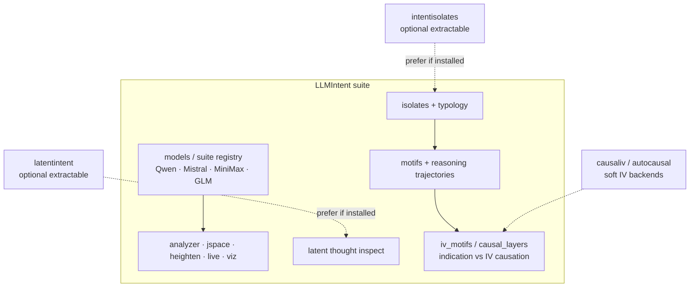

# LLMIntent suite architecture

**LLMIntent** is the suite home for semantic extraction **and** intent-structure tooling. Sibling repos (`intent-isolates`, `latent-intent-inspect`) remain extractable libraries; this package re-exports and vendors the offline path so one install covers the suite.

## Suite diagram



## Module map

| Import | Role |
|--------|------|
| `llmintent` / `llmintent.suite` | Curated model registry + analyzer entrypoints |
| `llmintent.isolates` | Identify isolates, typology, layers, reports |
| `llmintent.motifs` | Alias: `form_motifs`, `trajectory_from_motifs` |
| `llmintent.iv_motifs` / `llmintent.causal_layers` | `LayerCausalSuite` — indication vs IV |
| `llmintent.latent` | Latent thought inspection (`ThoughtReport`) |
| `llmintent.latent_vendor` | Vendored offline latent API (always present) |
| `llmintent.isolates._core` | Vendored offline IntentIsolates (always present) |

Resolution for isolates: **prefer** installed `intentisolates` ≥0.3; else use vendored `_core`.  
Resolution for latent: **prefer** installed `latentintent` ≥0.1; else use vendored `latent_vendor`. Torch / HF / `causaliv` remain soft for advanced paths.

## Latent thought inspection (1.2.0+)

`llmintent.latent` ships an offline **ThoughtReport** builder:

- Rule/heuristic intent tags
- Synthetic linear probe demo metrics
- SAE-lite sparse codes (sklearn)
- Logit-lens stub
- Mandatory epistemic caveats (correlates ≠ mind-reading)

```python
from llmintent import latent

print(latent.describe())
report = latent.inspect_text("I want X but cannot Y. What should I do?")
print(report.to_json())
```

```bash
python -m llmintent latent --text "I want X but cannot Y."
python -m llmintent latent --status
```

Optional HF residual capture: install extractable package

```bash
pip install "llmintent[latent]"   # pulls latentintent when published
# or: pip install -e ../LatentIntentInspect
python -m llmintent latent --text "..." --backend hf --model distilgpt2
```

SOTA research map (sibling tree): `research/docs/SOTA_LATENT_THOUGHT_INSPECTION.md`.

## One install

```bash
pip install llmintent
# optional: prefer external extractable packages
pip install "llmintent[isolates]"   # pulls intentisolates
pip install "llmintent[latent]"     # pulls latentintent when on PyPI
pip install "llmintent[suite]"      # isolates + latent
pip install "llmintent[models]"     # accelerate stack for large HF models
```

```python
from llmintent.isolates import identify_isolates, form_motifs, trajectory_from_motifs
from llmintent.iv_motifs import LayerCausalSuite
from llmintent import latent

isos = identify_isolates(text="I want X. I cannot Y. I will do Z.")
motifs = form_motifs(isos)
traj = trajectory_from_motifs(motifs, isos)
result = LayerCausalSuite.from_text("I want X. I will do Z.").run(outcome_hint="Z")
thought = latent.inspect_text("I want X. I cannot Y.")
```

## CLI umbrella

```bash
python -m llmintent isolates --text "..."
python -m llmintent motifs --text "..."
python -m llmintent reasoning-trajectory --text "..."
python -m llmintent trajectory --text "..."          # same as reasoning-trajectory
python -m llmintent trajectory --prompt "..."        # activation trajectory (model)
python -m llmintent iv-motifs --text "..." --mock-iv
python -m llmintent latent --text "..."              # ThoughtReport (offline)
python -m llmintent models list
```

## Epistemic notes

- Motifs / trajectories are **structural hypotheses**, not proven cognition.
- Abstract L0–L4 layers are a scaffold unless bound to residual indices.
- **Indication ≠ causation** — see IntentIsolates `LAYER_CAUSAL_IV.md` and IV reports.
- Latent ThoughtReports are **probes/heuristics**, not human mind-reading or proven model goals.

## Related packages

| Package | Role vs suite |
|---------|----------------|
| [intent-isolates](https://github.com/ehallford11714/intent-isolates) | Extractable lib; also vendored here |
| [latent-intent-inspect](https://github.com/ehallford11714/latent-intent-inspect) | Extractable latent inspect; soft-preferred by `llmintent.latent` |
| AutoCausalLib | Soft IV / `isolates-causal` bridge |
| CausalIVSuite | Preferred `causaliv` 2SLS when installed |
